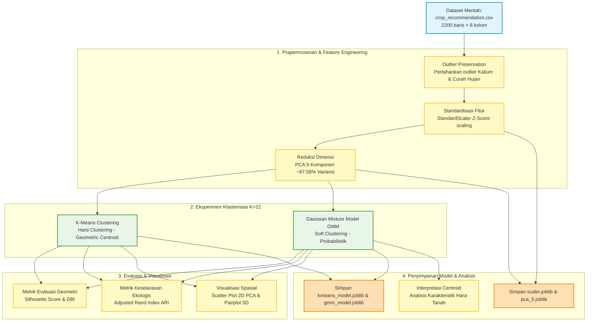
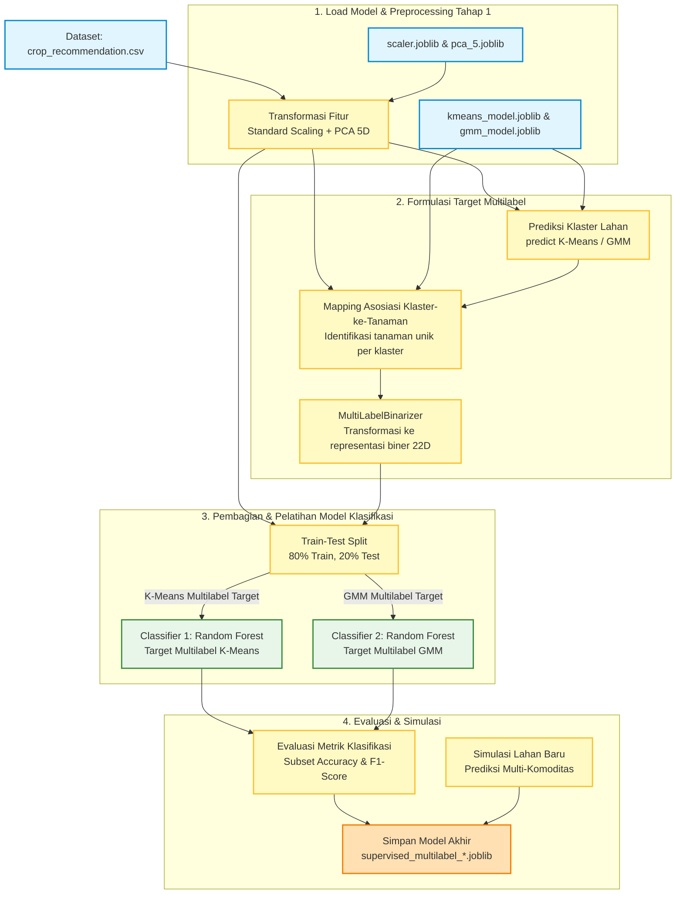

# Alur Pipeline Penelitian Rekomendasi Tanaman Multilabel

Dokumen ini merinci alur pipeline (two-stage machine learning pipeline) dari awal hingga akhir yang diterapkan pada proyek klasterisasi lahan pertanian untuk rekomendasi tanaman multilabel.

---

## 1. Fase 1: Unsupervised Clustering (`notebook kmeans-gmm.ipynb`)

Fase pertama berfokus pada pengelompokan lahan pertanian secara tidak terawasi (unsupervised clustering) menggunakan parameter agronomi tanah (N, P, K) dan mikroklimat.

### 1.1 Diagram Alur (Fase 1)

### 1.2 Tabel Rincian Langkah Pipeline Fase 1

| No     | Tahapan Pipeline                       | Deskripsi                                                                                                       | Input                                          | Proses / Transformasi                                                                                                                           | Output                                                                                        | File yang Dihasilkan / Terlibat                                                   |
| ------ | -------------------------------------- | --------------------------------------------------------------------------------------------------------------- | ---------------------------------------------- | ----------------------------------------------------------------------------------------------------------------------------------------------- | --------------------------------------------------------------------------------------------- | --------------------------------------------------------------------------------- |
| **1**  | **Data Loading**                       | Memuat dataset sekunder dari Kaggle untuk diproses.                                                             | File CSV                                       | Memuat data dan memisahkan kolom fitur agronomi (`N`, `P`, `K`, `temperature`, `humidity`, `ph`, `rainfall`) dengan kolom label tanaman aktual. | Dataframe Fitur ($X \in \mathbb{R}^{2200 \times 7}$) & Seri Label ($y \in \mathbb{R}^{2200}$) | `crop_recommendation.csv`                                                         |
| **2**  | **Outlier Preservation**               | Melakukan justifikasi pentingnya mempertahankan pencilan untuk menghindari hilangnya komoditas bernilai tinggi. | Dataframe Fitur ($X$)                          | Mempertahankan pencilan (terutama Kalium ekstrim pada Anggur/Apel) demi menjaga taksonomi tanaman biologis.                                     | Dataframe Fitur utuh ($X$)                                                                    | -                                                                                 |
| **3**  | **Standard Scaling**                   | Menyetarakan skala pengukuran seluruh fitur agar tidak membiaskan perhitungan jarak.                            | Dataframe Fitur ($X$)                          | Standardisasi z-score menggunakan `StandardScaler` agar perbedaan skala antar fitur tidak membiaskan klasterisasi.                              | Matriks Fitur Terstandar ($X_{\text{scaled}}$)                                                | `models/scaler.joblib`                                                            |
| **4**  | **Principal Component Analysis (PCA)** | Mereduksi dimensi untuk menghilangkan multikolinearitas dan derau spasial.                                      | Matriks Fitur Terstandar ($X_{\text{scaled}}$) | Mereduksi dimensi dari 7D menjadi 5D untuk mengatasi multikolinearitas (seperti korelasi tinggi P dan K) serta menyaring noise.                 | Matriks Komponen Utama ($X_{\text{pca}} \in \mathbb{R}^{2200 \times 5}$)                      | `models/pca_5.joblib`                                                             |
| **5**  | **Pemodelan K-Means**                  | Melatih model pengelompokan berbasis centroid.                                                                  | Matriks Komponen Utama ($X_{\text{pca}}$)      | Melatih K-Means dengan $K=22$ (sesuai jumlah tanaman asli), inisialisasi `k-means++`.                                                           | Model K-Means & Target Label Klaster                                                          | `models/kmeans_model.joblib`                                                      |
| **6**  | **Pemodelan GMM**                      | Melatih model pengelompokan berbasis distribusi probabilitas.                                                   | Matriks Komponen Utama ($X_{\text{pca}}$)      | Melatih Gaussian Mixture Model dengan $n\_components=22$ dan matriks kovariansi `full` (elipsoid).                                              | Model GMM & Probabilitas/Label Klaster                                                        | `models/gmm_model.joblib`                                                         |
| **7**  | **Evaluasi Spasial & Geometris**       | Menguji kualitas bentuk geometris klaster.                                                                      | $X_{\text{pca}}$, Label Klaster                | Menghitung Silhouette Score (kerapatan klaster) dan Davies-Bouldin Index (separasi klaster).                                                    | Skor metrik geometri klaster (Silhouette & DBI)                                               | -                                                                                 |
| **8**  | **Evaluasi Keselarasan Ekologis**      | Menguji kecocokan hasil klaster dengan komoditas asli.                                                          | Label Klaster, Label Aktual ($y$)              | Menghitung Adjusted Rand Index (ARI) untuk melihat kesesuaian klaster dengan rumpun komoditas tanaman asli.                                     | Nilai Adjusted Rand Index (ARI)                                                               | -                                                                                 |
| **9**  | **Visualisasi Hasil**                  | Menggambarkan hasil analisis secara visual untuk draf jurnal.                                                   | $X_{\text{pca}}$, Model, Target                | Membuat scatter plot 2D proyeksi PCA, heatmap sebaran komoditas per klaster, dan grafik distribusi ukuran klaster.                              | Grafik hasil analisis (Figure 1-7, 9-11)                                                      | `kmeans_pca_scatter.png`, `gmm_pca_scatter.png`, `cluster_distribution.png`, dll. |
| **10** | **Interpretasi Centroid**              | Memetakan profil tanah dari klaster ke kondisi hara dunia nyata.                                                | Model GMM, Dataset Asli                        | Menghitung rata-rata parameter agronomi asli untuk setiap klaster guna memetakan profil tanah ke rekomendasi tanaman.                           | Profil tanah per klaster                                                                      | -                                                                                 |

---

## 2. Fase 2: Supervised Multilabel (`supervised_multilabel.ipynb`)

Fase kedua berfokus pada pelatihan model klasifikasi multilabel terawasi (Random Forest) untuk memprediksi daftar tanaman yang kompatibel dengan sebidang tanah, berbasis hasil klasterisasi Fase 1.

### 2.1 Diagram Alur (Fase 2)

### 2.2 Tabel Rincian Langkah Pipeline Fase 2

| No     | Tahapan Pipeline                      | Deskripsi                                                                     | Input                                         | Proses / Transformasi                                                                                                                            | Output                                                                                          | File yang Dihasilkan / Terlibat                                                         |
| ------ | ------------------------------------- | ----------------------------------------------------------------------------- | --------------------------------------------- | ------------------------------------------------------------------------------------------------------------------------------------------------ | ----------------------------------------------------------------------------------------------- | --------------------------------------------------------------------------------------- |
| **1**  | **Data Loading**                      | Memuat dataset agronomi asli.                                                 | File CSV                                      | Memuat data lahan asli.                                                                                                                          | Dataframe Fitur ($X$) & Label Aktual ($y$)                                                      | `crop_recommendation.csv`                                                               |
| **2**  | **Load Model Tahap 1**                | Mengintegrasikan model prapemrosesan dan klasterisasi dari tahap sebelumnya.  | Model tersimpan (.joblib)                     | Memuat model standardisasi, reduksi dimensi, dan klasterisasi dari Tahap 1.                                                                      | Objek model (`scaler`, `pca`, `kmeans`, `gmm`)                                                  | `scaler.joblib`, `pca_5.joblib`, `kmeans_model.joblib`, `gmm_model.joblib`              |
| **3**  | **Preprocessing & Reduksi**           | Menransformasikan data mentah agar selaras dengan koordinat fitur di Tahap 1. | Dataframe Fitur ($X$)                         | Melakukan penskalaan dan reduksi dimensi menggunakan model Tahap 1 yang dimuat.                                                                  | Matriks PCA ($X_{\text{pca}} \in \mathbb{R}^{2200 \times 5}$)                                   | -                                                                                       |
| **4**  | **Prediksi Keanggotaan Klaster**      | Menentukan indeks klaster lahan untuk setiap data.                            | Matriks PCA ($X_{\text{pca}}$)                | Memprediksi indeks klaster tanah untuk setiap baris data menggunakan model K-Means dan GMM.                                                      | Label Klaster K-Means & GMM                                                                     | -                                                                                       |
| **5**  | **Pemetaan Klaster-ke-Tanaman**       | Menentukan asosiasi tanaman yang kompatibel per klaster.                      | Label Klaster, Label Aktual ($y$)             | Memetakan setiap klaster $k$ ke seluruh jenis tanaman unik yang menempati klaster tersebut untuk membentuk rekomendasi multi-komoditas.          | Kamus Asosiasi (contoh: Klaster 20 $\mapsto$ \{Padi, Pepaya\})                                  | -                                                                                       |
| **6**  | **Pembentukan Target Multilabel**     | Mentransformasikan daftar tanaman menjadi representasi biner.                 | Indeks Klaster per baris, Kamus Asosiasi      | Mengubah daftar tanaman rekomendasi per klaster menjadi representasi biner (multi-hot encoding) berdimensi 22 menggunakan `MultiLabelBinarizer`. | Matriks Target Biner ($Y_{\text{bin\_km}}, Y_{\text{bin\_gm}} \in \mathbb{R}^{2200 \times 22}$) | -                                                                                       |
| **7**  | **Train-Test Split**                  | Membagi data untuk pengujian generalisasi model.                              | Fitur $X_{\text{pca}}$, Target $Y$            | Memisahkan data menjadi set pelatihan (80%) dan set pengujian (20%) secara acak.                                                                 | $X_{\text{train}}, X_{\text{test}}, Y_{\text{train}}, Y_{\text{test}}$                          | -                                                                                       |
| **8**  | **Pelatihan RandomForest Multilabel** | Melatih model klasifikasi terawasi multilabel.                                | Fitur Train & Target Train                    | Melatih model `MultiOutputClassifier` yang dibungkus dengan `RandomForestClassifier(n_estimators=100)` pada target biner masing-masing.          | Classifier Multilabel Terlatih                                                                  | `models/supervised_multilabel_kmeans.joblib`, `models/supervised_multilabel_gmm.joblib` |
| **9**  | **Evaluasi Klasifikasi**              | Mengukur performa generalisasi model pada data uji.                           | Data Uji ($X_{\text{test}}, Y_{\text{test}}$) | Menguji akurasi model menggunakan **Subset Accuracy** (kesesuaian persis seluruh label biner) dan **F1-Score (Micro & Macro)**.                  | Nilai metrik akurasi klasifikasi multilabel                                                     | `model_comparison_bar.png`, `multilabel_confusion_matrix.png`                           |
| **10** | **Simulasi Prediksi Lahan Baru**      | Menguji fungsionalitas sistem rekomendasi untuk pengguna akhir.               | Parameter tanah baru (7D)                     | Mengalirkan input baru melalui `scaler` $\to$ `pca_5` $\to$ model supervised multilabel terlatih $\to$ deteksi tanaman yang direkomendasikan.    | Daftar nama komoditas tanaman alternatif                                                        | -                                                                                       |
