# DRAF PENULISAN JURNAL ILMIAH (TARGET: SINTA 3)

**"Comparative Study of Clustering Hybrid Pipelines for Multi-Label Crop Recommendation"**  
_(Studi Komparatif Pipa Klasterisasi Hibrida untuk Rekomendasi Tanaman Multilabel)_

---

## 1. BAB I: PENDAHULUAN (INTRODUCTION)

### 1.1 Abstrak & Abstract

**Abstrak**  
Pemilihan jenis komoditas yang tidak sesuai dengan karakteristik agronomi lahan merupakan penyebab utama rendahnya produktivitas pertanian presisi. Secara akademis, sistem rekomendasi tanaman konvensional sering kali didekati dengan klasifikasi terawasi (_supervised learning_) berlabel tunggal (_single-label_). Namun, secara ekologis dan kebutuhan bisnis tani, sebidang lahan bersifat multi-kompatibel (cocok untuk beberapa jenis tanaman sekaligus), sehingga permasalahan ini secara esensial merupakan kasus **rekomendasi multilabel**. Penelitian ini mengusulkan solusi rekomendasi tanaman multilabel berbasis pembelajaran dua tahap. Tahap pertama melakukan klasterisasi karakteristik lahan secara tidak terawasi (_unsupervised_) menggunakan reduksi dimensi _Principal Component Analysis_ (PCA) 5-komponen dan dua pendekatan klasterisasi: _K-Means_ (sebagai representasi klasterisasi kaku atau _hard clustering_ berbasis Jarak Geometris/Centroid-based) dan _Gaussian Mixture Model_ (GMM) (sebagai representasi klasterisasi lunak atau _soft clustering_ berbasis Distribusi Probabilitas/Distribution-based). Hasil klasterisasi dari K-Means dan GMM kemudian digunakan untuk melatih model tahap kedua yaitu klasifikasi terawasi multilabel (_supervised multilabel_) guna memprediksi rekomendasi tanaman secara presisi. Hasil eksperimen tahap pertama menunjukkan bahwa GMM menunjukkan performa lebih baik dalam memodelkan batas sebaran data alami dengan _Adjusted Rand Index_ (ARI) mencapai 0,816, lebih tinggi dibandingkan K-Means dengan ARI sebesar 0,519, meskipun K-Means menghasilkan pemisahan spasial geometris yang lebih tegas (Silhouette Score 0,307 dan DBI 1,081). Evaluasi tahap kedua menggunakan validasi multi-seed (seed: 0, 42, 99) menunjukkan model klasifikasi terawasi multilabel berbasis target GMM mencapai rata-rata Subset Accuracy sebesar 83,03% (F1-Score Micro 0,9285), sedangkan model berbasis target K-Means mencapai rata-rata Subset Accuracy 82,88% (F1-Score Micro 0,9535).  
**Kata Kunci:** Rekomendasi Tanaman Multilabel, Unsupervised Learning, K-Means, Gaussian Mixture Model, Supervised Multilabel.

**Abstract**  
_Selecting crop commodities that do not match the agronomic characteristics of the land is the primary cause of low precision agriculture productivity. Academically, conventional crop recommendation systems are often approached using single-label supervised learning. However, ecologically and for farming business needs, a plot of land is multi-compatible (suitable for several crop types simultaneously), making this problem essentially a multi-label recommendation case. This study proposes a two-stage learning-based multi-label crop recommendation solution. The first stage clusters land characteristics in an unsupervised manner using 5-component Principal Component Analysis (PCA) dimension reduction and two clustering approaches: K-Means (representing rigid spatial partitioning or hard clustering based on Geometric Distance/Centroid-based) and Gaussian Mixture Model (GMM) (representing probabilistic boundary partitioning or soft clustering based on Probability Distribution/Distribution-based). The clustering results from K-Means and GMM are then utilized to train the second-stage model, which is a supervised multi-label classifier, to predict crop recommendations. First-stage experimental results demonstrate that GMM performs better in modeling natural data distribution boundaries, achieving an Adjusted Rand Index (ARI) of 0.816, which is higher than K-Means with an ARI of 0.519, although K-Means yields a tighter geometric spatial separation (Silhouette Score of 0.307 and DBI of 1.081). Second-stage evaluation under multi-seed validation (seeds: 0, 42, 99) shows that the GMM-based supervised multi-label model achieves an average Subset Accuracy of 83.03% (F1-Score Micro of 0.9285), while the K-Means-based model achieves an average Subset Accuracy of 82.88% (F1-Score Micro of 0.9535)._  
**Keywords:** Multilabel Crop Recommendation, Unsupervised Learning, K-Means, Gaussian Mixture Model, Supervised Multilabel.

---

### 1.2 Latar Belakang dan Permasalahan

Optimalisasi penanaman komoditas pertanian di era modern sangat bergantung pada analisis komparatif parameter hara tanah seperti Nitrogen (N), Fosfor (P), Kalium (K), serta variabel iklim mikro seperti temperatur, kelembaban, pH tanah, dan curah hujan [1]. Ketidakcocokan antara komoditas yang ditanam dengan karakteristik lahan sering kali menjadi penyebab utama rendahnya produktivitas pertanian presisi serta kegagalan panen yang merugikan secara ekonomi [2]. Oleh sebab itu, pengembangan sistem rekomendasi tanaman berbasis komputasi cerdas diperlukan untuk meminimalisasi risiko kegagalan budidaya melalui pencocokan parameter biofisik tanah secara objektif [3].

Meskipun demikian, mayoritas penelitian sistem rekomendasi tanaman konvensional saat ini masih didekati dengan paradigma klasifikasi terawasi berlabel tunggal (_single-label supervised learning_), di mana model hanya memprediksi satu jenis tanaman untuk satu set parameter tanah [4]. Pendekatan ini secara ekologis kurang realistis karena sebidang lahan pertanian pada kenyataannya sering kali memiliki tingkat kompatibilitas yang tinggi terhadap beberapa jenis tanaman sekaligus [5]. Pembatasan pada satu komoditas tunggal mengabaikan potensi rotasi tanaman, pertanian tumpang sari (_intercropping_), dan strategi diversifikasi risiko kerugian bagi petani [6]. Oleh karena itu, permasalahan rekomendasi tanaman secara esensial merupakan kasus klasifikasi multilabel (_multilabel classification_) [13], [14].

Tantangan utama dalam menerapkan pembelajaran terawasi multilabel pada sektor pertanian adalah kelangkaan dan mahalnya biaya pengumpulan dataset berlabel multilabel secara langsung di laboratorium hara tanah [6], [13]. Untuk mengatasi keterbatasan data berlabel ini, teknik klasterisasi tidak terawasi (_unsupervised clustering_) dapat dimanfaatkan untuk mengelompokkan profil tanah secara mandiri berdasarkan kesamaan parameter fisika dan kimia [7], [12]. Dengan memetakan sebaran lahan secara alami, setiap klaster tanah yang terbentuk secara inheren akan diisi oleh beberapa komoditas tanaman yang memiliki karakteristik hara yang serupa. Hasil pengelompokan tanpa label inilah yang kemudian diekstrak untuk membentuk target biner multilabel guna melatih model klasifikasi terawasi tahap kedua tanpa membutuhkan anotasi manual yang mahal [14], [15].

### 1.3 Celah Penelitian (Research Gap) dan Kebaruan (Novelty)

Beberapa penelitian terdahulu di bidang rekomendasi tanaman tumpang sari umumnya hanya menggunakan satu pendekatan klasterisasi kaku seperti K-Means untuk pemetaan wilayah saja [7], atau berhenti pada tahap pengelompokan wilayah tanpa pemodelan prediktif klasifikasi [6], [7]. Selain itu, riset-riset tersebut kerap mengabaikan pengaruh pra-pemrosesan data seperti eliminasi pencilan (_outliers_) yang secara statistik sering disingkirkan sebagai derau (_noise_), padahal pencilan tersebut merepresentasikan kondisi tanah ekstrem bagi komoditas khusus bernilai ekonomi tinggi [3], [8]. Hal ini menciptakan celah penelitian (_research gap_) mengenai perbandingan efektivitas antara berbagai paradigma klasterisasi dan pengaruh preservasi pencilan terhadap keutuhan informasi agronomi.

Untuk memperjelas celah penelitian (_research gap_) tersebut, ringkasan perbandingan studi literatur terdahulu dengan pendekatan yang diusulkan disajikan pada Tabel 1 di bawah ini:

**Tabel 1. Perbandingan Penelitian Terdahulu dan Penelitian yang Diusulkan**

| Author (Year)                     | Method                                   | Output                             | Limitation / Gap                                                                                                                                                                                         |
| :-------------------------------- | :--------------------------------------- | :--------------------------------- | :------------------------------------------------------------------------------------------------------------------------------------------------------------------------------------------------------- |
| **Savla et al. [6] (2022)**       | Random Forest, Decision Tree, SVM        | Single-label Crop Recommendation   | Hanya mendukung rekomendasi satu jenis komoditas tunggal (_single-label_), mengabaikan kompatibilitas multi-komoditas lahan secara ekologis.                                                             |
| **Purba et al. [7] (2022)**       | K-Means Clustering                       | Soil Zone Mapping                  | Berhenti pada pemetaan zona tanah tanpa adanya pemodelan prediktif klasifikasi lanjutan untuk rekomendasi komoditas spesifik.                                                                            |
| **Karthikeyan et al. [8] (2020)** | Decision Tree, Naive Bayes               | Crop Recommendation (Single-label) | Menerapkan eliminasi pencilan global (IQR), menyebabkan tanaman berkebutuhan ekstrem seperti apel dan anggur menghilang dari sistem.                                                                     |
| **Penelitian Ini (Proposed)**     | **PCA + K-Means vs GMM + Multilabel RF** | **Multilabel Crop Recommendation** | Menyelesaikan _single-label constraint_, membandingkan paradigma klasterisasi kaku dan lunak (_hard/soft clustering_), serta mempertahankan pencilan (_outlier preservation_) untuk keberagaman tanaman. |

Kontribusi utama penelitian ini terletak pada tiga aspek yang saling melengkapi. Pipeline dua tahap yang diusulkan mengintegrasikan reduksi dimensi PCA dengan klasterisasi tidak terawasi sebagai generator label otomatis — mengeliminasi kebutuhan anotasi manual multilabel yang mahal [14]. Lebih lanjut, evaluasi komparatif antara K-Means dan GMM dilakukan tidak hanya pada metrik klasterisasi konvensional, tetapi juga pada dampaknya terhadap kualitas label target di tahap supervisi [15]. Terakhir, justifikasi empiris terhadap kebijakan pemeliharaan pencilan disajikan melalui analisis kuantitatif kehilangan data per komoditas, menunjukkan bahwa penghapusan pencilan (_outlier_) statistik global bersifat destruktif bagi taksonomi komoditas berkebutuhan ekstrem.

### 1.4 Rumusan Masalah dan Tujuan Penelitian

Berdasarkan identifikasi celah penelitian pada sub-bab sebelumnya, penelitian ini merumuskan tiga pertanyaan penelitian (_research questions_) sebagai berikut:

- **RQ1:** Apakah pendekatan klasterisasi lunak (_soft clustering_) berbasis distribusi probabilitas (GMM) menghasilkan pengelompokan tanah yang lebih selaras dengan rumpun varietas tanaman asli dibandingkan klasterisasi kaku (_hard clustering_) berbasis jarak geometris (K-Means) pada data agronomi berdimensi tinggi?
- **RQ2:** Apakah kualitas partisi klaster yang dihasilkan pada Tahap 1 (unsupervised) secara signifikan memengaruhi akurasi prediksi rekomendasi tanaman multilabel pada Tahap 2 (supervised)?
- **RQ3:** Sejauh mana kebijakan pemeliharaan pencilan agronomi (_outlier preservation_) berdampak terhadap kelengkapan taksonomi komoditas dalam sistem rekomendasi berbasis klasterisasi?

Sesuai dengan rumusan masalah di atas, penelitian ini memiliki tiga tujuan terukur:

1. Membandingkan kualitas klasterisasi K-Means dan GMM secara kuantitatif menggunakan metrik Silhouette Score, Davies-Bouldin Index (DBI), serta mengukur keselarasan ekologisnya menggunakan Adjusted Rand Index (ARI) terhadap label tanaman asli (sebagai ground truth referensi biologis) pada ruang fitur agronomi tereduksi PCA 5D.
2. Menganalisis dampak pilihan algoritma klasterisasi terhadap performa klasifikasi terawasi multilabel pada Tahap 2, menggunakan Subset Accuracy dan F1-Score sebagai ukuran evaluasi, divalidasi dengan eksperimen multi-seed (seed: 0, 42, 99).
3. Menganalisis secara empiris bagaimana penerapan eliminasi pencilan berbasis IQR global secara langsung pada dataset agronomi ini menyebabkan hilangnya komoditas tanaman tertentu dari sistem rekomendasi.

---

## 2. BAB II: METODE PENELITIAN (METHODOLOGY)

### 2.1 Alur Penelitian (Research Flow)

Secara umum, tahapan dan alur penelitian ini dirancang dalam dua fase utama sebagaimana divisualisasikan pada diagram alur penelitian di **Gambar 1** di bawah ini:

- **Gambar 1: Diagram Alur Penelitian (Research Flow Diagram)**
  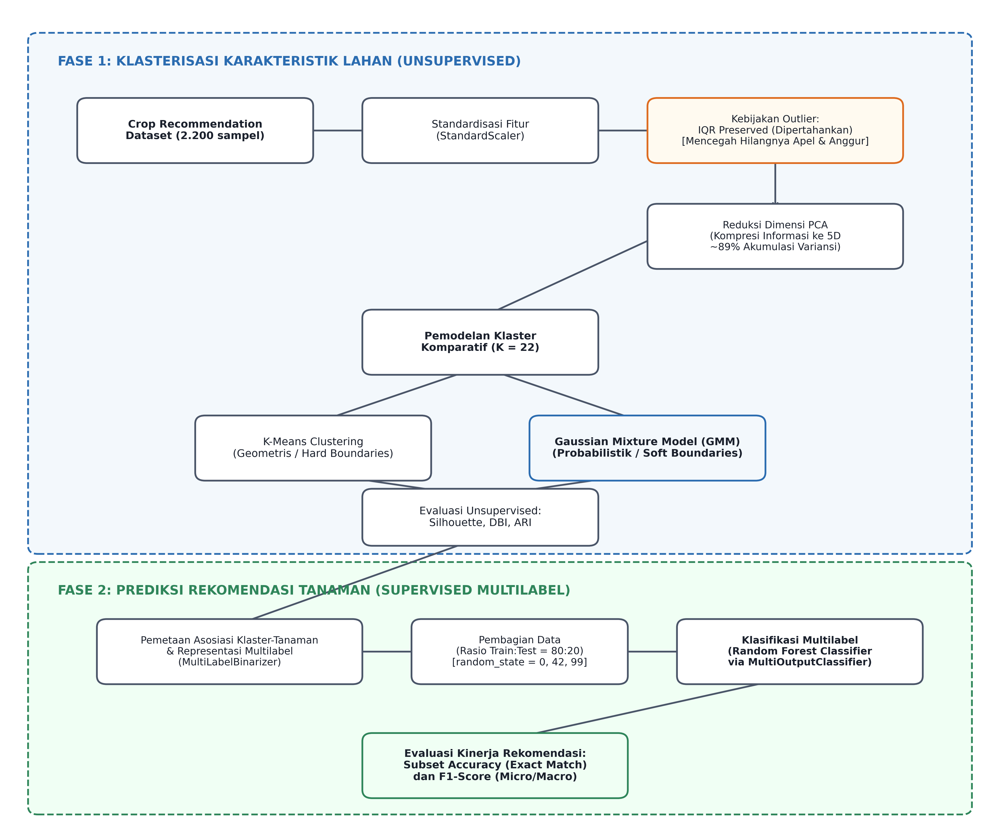

_Deskripsi:_ Diagram alur penelitian yang menggambarkan integrasi Fase 1 (unsupervised clustering untuk identifikasi klaster karakteristik lahan) dan Fase 2 (supervised multilabel classification untuk prediksi rekomendasi tanaman).

Metode dirancang dalam dua fase utama:

**Fase 1: Klasterisasi Karakteristik Lahan (Unsupervised)**

1. **Pengumpulan & Preprocessing Data:** Menggunakan _Crop Recommendation Dataset_ (2.200 sampel) dengan standardisasi fitur menggunakan `StandardScaler`. Kebijakan pemeliharaan outlier diterapkan untuk mempertahankan tanaman berkebutuhan ekstrem.
2. **Feature Engineering (Reduksi Dimensi):** Menerapkan PCA 5-komponen untuk kompresi informasi (~89% variansi kumulatif) dan PCA 2-komponen untuk kebutuhan visualisasi.
3. **Pemodelan Klaster Komparatif ($K=22$):** Membandingkan dua model dengan pendekatan matematika berbeda:
    - **K-Means**: Mewakili pendekatan klasterisasi kaku (_hard clustering_) berbasis Jarak Geometris (Centroid-based).
    - **Gaussian Mixture Model (GMM)**: Mewakili pendekatan klasterisasi lunak (_soft clustering_) berbasis Distribusi Probabilitas (Distribution-based).
4. **Evaluasi Unsupervised:** Menilai kualitas pengelompokan menggunakan Silhouette Score dan Davies-Bouldin Index (DBI) sebagai metrik geometri internal, serta Adjusted Rand Index (ARI) untuk mengukur keselarasan hasil klasterisasi terhadap label tanaman asli yang tersedia pada dataset (berperan sebagai ground truth referensi biologis).

**Fase 2: Prediksi Rekomendasi Tanaman (Supervised Multilabel)**

1. **Formulasi Dataset Multilabel:** Mengekstrak hasil pengelompokan K-Means dan GMM untuk membentuk label rekomendasi tanaman multilabel.
2. **Pelatihan Model Kedua (Supervised Multilabel):** Melatih model pengklasifikasi multilabel menggunakan fitur agronomi sebagai input dan label hasil klasterisasi sebagai output target.
3. **Evaluasi Prediksi:** Mengukur tingkat akurasi tebakan rekomendasi tanaman menggunakan metrik **Subset Accuracy** dan **F1-Score**.

### 2.2 Tinjauan Metodologi (Methodology Review)

Bagian ini merangkum detail spesifikasi teknis dan hyperparameter dari seluruh komponen pemrosesan data dan algoritma yang diimplementasikan:

#### 1. Dataset Agronomi

- **Sumber & URL Dataset:** _Crop Recommendation Dataset_ yang diunggah oleh Atharva Ingle di platform Kaggle ([Tautan Dataset](https://www.kaggle.com/datasets/atharvaingle/crop-recommendation-dataset)).
- **Jenis Dataset:** Dataset ini merupakan dataset benchmarking sekunder yang dihasilkan secara sintetis/semi-sintetis berdasarkan rentang kebutuhan agronomi tanaman riil, guna menghasilkan distribusi kelas yang seimbang sempurna (_balanced_) untuk keperluan pengujian algoritma machine learning.
- **Karakteristik:** Dataset ini memiliki 2.200 sampel tanah (masing-masing tanaman memiliki 100 sampel data).
- **Fitur Agronomi:** Terdiri dari 7 fitur numerik: unsur hara tanah makro yaitu Nitrogen (N), Fosfor (P), Kalium (K); dan iklim mikro yaitu temperatur (temperature), kelembaban (humidity), derajat keasaman (ph), dan curah hujan (rainfall).

Statistik deskriptif untuk ketujuh fitur agronomi tersebut dirangkum dalam Tabel 2 berikut:

**Tabel 2. Statistik Deskriptif Parameter Agronomi Dataset (Sebelum Standardisasi)**

| Parameter        | Satuan |  Mean  |  Std  |  Min  |  25%  | 50% (Median) |  75%   |  Max   |
| :--------------- | :----: | :----: | :---: | :---: | :---: | :----------: | :----: | :----: |
| **Nitrogen (N)** | mg/kg  | 50,55  | 36,92 | 0,00  | 21,00 |    37,00     | 84,25  | 140,00 |
| **Fosfor (P)**   | mg/kg  | 53,36  | 32,99 | 5,00  | 28,00 |    51,00     | 68,00  | 145,00 |
| **Kalium (K)**   | mg/kg  | 48,15  | 50,65 | 5,00  | 20,00 |    32,00     | 49,00  | 205,00 |
| **Temperatur**   |   °C   | 25,62  | 5,06  | 8,83  | 22,77 |    25,60     | 28,56  | 43,68  |
| **Kelembaban**   |   %    | 71,48  | 22,26 | 14,26 | 60,26 |    80,47     | 89,95  | 99,98  |
| **pH**           |   pH   |  6,47  | 0,77  | 3,50  | 5,97  |     6,43     |  6,92  |  9,94  |
| **Curah Hujan**  |   mm   | 103,46 | 54,96 | 20,21 | 64,55 |    94,87     | 124,27 | 298,56 |

Perbedaan skala pengukuran yang sangat lebar pada Tabel 2 (seperti Kalium yang memiliki nilai maksimum 205 mg/kg berbanding terbalik dengan pH dengan nilai minimum 3,50) dapat membiaskan perhitungan jarak Euclidean pada algoritma klasterisasi. Oleh karena itu, standardisasi menggunakan z-score scaling (`StandardScaler`) mutlak diperlukan sebagai tahap prapemrosesan awal.

- **Gambar 2: Distribusi Frekuensi 7 Variabel Agronomi & Mikroklimat**
  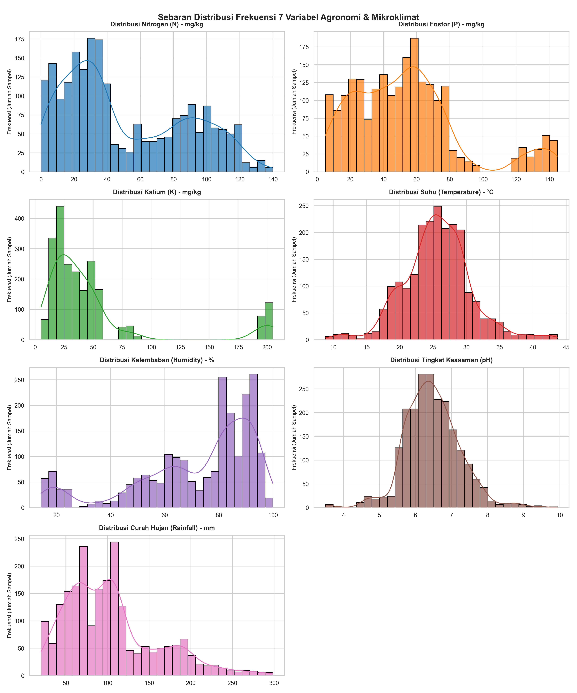
  _Deskripsi:_ Grafik histogram dan KDE untuk 7 variabel input agronomi, menunjukkan distribusi unimodal/normal pada temperatur, kelembaban, dan pH, serta distribusi bimodal/skewed pada Nitrogen (N), Fosfor (P), Kalium (K), dan curah hujan (rainfall).

- **Gambar 3: Sebaran Sampel 22 Kelas Komoditas Tanaman (Ground Truth)**
  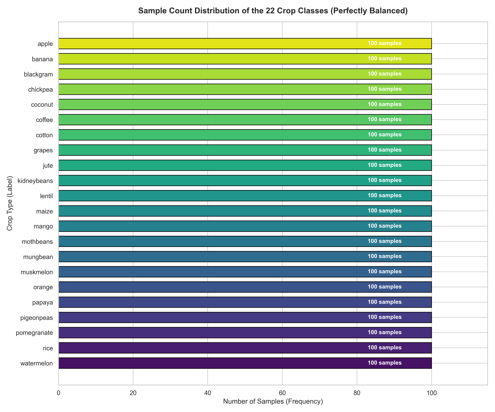
  _Deskripsi:_ Diagram batang horizontal sebaran frekuensi sampel 22 jenis tanaman target aktual (ground truth). Dataset memiliki persebaran seimbang sempurna, dengan masing-masing komoditas memiliki tepat 100 sampel data.

- **Gambar 4: Matriks Korelasi Fitur Agronomi**
  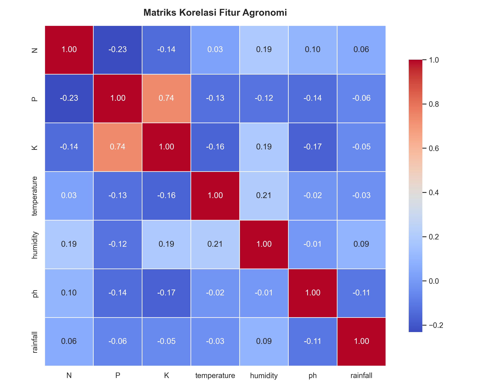
  _Deskripsi:_ Heatmap matriks korelasi Pearson antara 7 fitur input agronomi numerik. Korelasi positif terkuat terlihat antara Fosfor (P) dan Kalium (K) sebesar 0,74, sedangkan hubungan lainnya cenderung memiliki korelasi lemah atau independen.

#### 2. Analisis Reduksi Dimensi (PCA)

Metode _Principal Component Analysis_ (PCA) [19] digunakan untuk menyusutkan data berdimensi 7 (7D) yang merepresentasikan 7 fitur input agronomi asli menjadi ruang ortogonal baru berdimensi 5 (5D). Reduksi dimensi ini bertujuan untuk:

- **Mengeliminasi Multikolinearitas:** Berdasarkan visualisasi matriks korelasi pada **Gambar 4**, fitur Fosfor (P) dan Kalium (K) memiliki hubungan linier positif kuat ($r = 0,74$) yang dapat mengganggu kestabilan perhitungan jarak spasial. PCA mentransformasikan data menjadi komponen-komponen baru (PC1 hingga PC5) yang saling tegak lurus (ortogonal) sehingga korelasi antar komponen bernilai nol.
- **Menyaring Derau Spasial (Noise Filtering):** Membuang variasi data skala kecil yang bersifat acak dan tidak berkontribusi terhadap struktur kelompok alami.
- **Mempertahankan Kandungan Informasi:** Walaupun jumlah dimensi dikurangi dari 7 menjadi 5, model tetap mempertahankan akumulasi variansi informasi (_explained variance_) sebesar **87,58%** dari total informasi asli. Detail nilai per komponen adalah:

- **PC1:** Explained Variance = 27,59% (Eigenvalue = 1,932)
- **PC2:** Explained Variance = 18,48% (Eigenvalue = 1,294)
- **PC3:** Explained Variance = 15,38% (Eigenvalue = 1,077)
- **PC4:** Explained Variance = 14,61% (Eigenvalue = 1,023)
- **PC5:** Explained Variance = 11,51% (Eigenvalue = 0,806)
- _Justifikasi Pemilihan:_ 5 komponen utama dipilih berdasarkan kriteria Kaiser (eigenvalue $\geq 1$ atau mendekati 1), di mana PC5 dengan eigenvalue 0,806 dipertahankan agar dapat menangkap curah hujan mikro dan variasi pH ekstrim tanpa kehilangan informasi esensial.

#### 3. Model Klasterisasi K-Means

Algoritma K-Means merupakan pendekatan klasterisasi kaku yang meminimalkan inersia kuadrat jarak Euclidean centroid. Konfigurasi hyperparameter yang digunakan:

- **n_clusters:** 22. Pemilihan jumlah klaster ini didasarkan pada pendekatan heuristik terarah untuk menyelaraskan hasil partisi tidak terawasi dengan jumlah komoditas tanaman asli (_ground truth_) dalam dataset. Hal ini bertujuan agar setiap klaster secara rata-rata dapat mewakili amplop ekologis/profil tanah dari minimal satu komoditas spesifik, sehingga pemetaan asosiasi klaster-ke-tanaman untuk pembentukan label multilabel pada Tahap 2 memiliki derajat keterwakilan yang optimal.
- **init:** `'k-means++'` (untuk inisialisasi centroid awal yang tersebar optimal guna mempercepat konvergensi).
- **n_init:** 10 (algoritma dijalankan 10 kali secara independen dengan centroid acak untuk memilih hasil dengan inersia terendah).
- **max_iter:** 300 (iterasi pergeseran centroid maksimum per run).
- **random_state:** 42 (untuk menjaga reproduksibilitas hasil klasterisasi).

Fungsi tujuan yang diminimalkan oleh K-Means dirumuskan secara formal pada **Persamaan (1)**.

#### 4. Model Gaussian Mixture Model (GMM)

Gaussian Mixture Model memodelkan data sebagai kombinasi linier dari beberapa distribusi Gaussian multivariat. Konfigurasi yang diterapkan:

- **n_components:** 22 (jumlah komponen disamakan dengan $K=22$ klaster K-Means demi konsistensi komparasi batas keputusan).
- **covariance_type:** `'full'` (setiap komponen memiliki matriks kovariansi bebas sendiri, memungkinkan klaster berbentuk elipsoid miring tak beraturan).
- **n_init:** 1 (jumlah inisialisasi parameter algoritma Expectation-Maximization. Nilai `n_init=1` memadai karena Scikit-Learn secara default menginisialisasi parameter GMM menggunakan centroid hasil algoritma K-Means (`init_params='kmeans'`). Karena K-Means sebelumnya dijalankan kokoh dengan `n_init=10` untuk menemukan pusat klaster terbaik, trajectory EM langsung dimulai dari koordinat spasial yang terstruktur secara optimal, bukan parameter acak mentah. Ditambah penguncian `random_state=42`, hasil klasterisasi dijamin deterministik dan stabil).
- **random_state:** 42 (untuk konsistensi inisialisasi parameter probabilistik).

Model GMM dioptimalkan menggunakan algoritma _Expectation-Maximization_ (EM) untuk memaksimalkan fungsi log-likelihood data yang dirumuskan pada **Persamaan (2)**.

#### 5. Model Random Forest (Supervised Multilabel Classifier)

Pengklasifikasi multilabel diimplementasikan melalui pembungkus `MultiOutputClassifier` dengan estimator dasar `RandomForestClassifier`:

- **n_estimators:** 100 (jumlah pohon keputusan di dalam model forest).
- **max_depth:** `None` (pohon tumbuh bebas hingga seluruh daun murni atau menampung sampel kurang dari batas minimum pembelahan. Kebijakan ini bertujuan untuk menekan bias klasifikasi pada data latih dengan Train Subset Accuracy mencapai 100,00%. Meskipun terdapat selisih sekitar 15% hingga 19% terhadap Test Subset Accuracy (~84% s.d. 85%), model menunjukkan indikasi overfitting moderat yang masih dapat ditoleransi karena performa pengujian tetap stabil pada berbagai konfigurasi kedalaman dengan dukungan regularisasi bawaan Random Forest (seperti bagging dan pemilihan fitur acak) yang menjaga kemampuan generalisasi).
- **criterion:** `'gini'` (indeks ketidakmurnian Gini digunakan untuk mengukur kualitas pembagian cabang).

#### 6. Pembagian Data (Split Data)

- **Rasio Train/Test:** 80:20 (80% atau 1.760 data digunakan sebagai data latih dan 20% atau 440 data sebagai data uji klasifikasi).
- **Stratifikasi:** _Tidak stratified_. Karena target merupakan matriks biner multilabel (multi-hot encoding), scikit-learn secara default tidak mendukung stratifikasi silang langsung pada matriks multidimensi tanpa algoritma stratifikasi berulang khusus (_iterative stratification_). Oleh sebab itu, pemisahan acak acuan statis (`random_state=42`) diterapkan.

#### 7. Lingkungan Pengembangan (Development Environment)

Eksperimen komputasi dijalankan pada perangkat keras dan lingkungan perangkat lunak dengan spesifikasi yang dirangkum pada **Tabel 3** di bawah ini:

**Tabel 3. Spesifikasi Lingkungan Pengembangan (Environment Setup)**

| Item    | Value   |
| :------ | :------ |
| Python  | 3.12    |
| sklearn | 1.5     |
| CPU     | Ryzen 5 |
| RAM     | 16 GB   |

Pustaka pendukung lainnya meliputi Pandas versi 2.3.3 untuk manipulasi data, Numpy versi 2.2.6 untuk komputasi numerik, dan Joblib untuk persistensi model.

#### 8. Formulasi Matematika Metrik Evaluasi

Untuk mendukung transparansi dan reproduksibilitas eksperimen, berikut adalah formulasi matematis dari setiap metrik evaluasi yang digunakan:

**Persamaan 1 — K-Means Objective Function (Inertia):**

Algoritma K-Means meminimalkan jumlah kuadrat jarak dalam klaster (_within-cluster sum of squares_ / WCSS) sesuai dengan Persamaan (1):

$$J = \sum_{k=1}^{K} \sum_{\mathbf{x}_i \in C_k} \|\mathbf{x}_i - \boldsymbol{\mu}_k\|^2 \tag{1}$$

di mana $\mathbf{x}_i \in \mathbb{R}^5$ adalah vektor koordinat sampel ke-$i$ pada ruang komponen utama PCA (5D), $C_k$ adalah himpunan sampel pada klaster ke-$k$, $\boldsymbol{\mu}_k$ adalah vektor centroid klaster ke-$k$, dan $K=22$ adalah jumlah klaster.

**Persamaan 2 — GMM Log-Likelihood (EM Objective):**

GMM mengoptimalkan log-likelihood dari data $\mathbf{X} = \{\mathbf{x}_1, \ldots, \mathbf{x}_N\}$ dengan $\mathbf{x}_i \in \mathbb{R}^5$ melalui algoritma Expectation-Maximization sesuai dengan Persamaan (2):

$$\mathcal{L}(\boldsymbol{\theta}) = \sum_{i=1}^{N} \log \sum_{k=1}^{K} \pi_k \, \mathcal{N}(\mathbf{x}_i \mid \boldsymbol{\mu}_k, \boldsymbol{\Sigma}_k) \tag{2}$$

di mana $\pi_k$ adalah bobot campuran komponen ke-$k$ ($\sum_k \pi_k = 1$), $\boldsymbol{\mu}_k$ dan $\boldsymbol{\Sigma}_k$ adalah vektor rerata dan matriks kovariansi penuh (_full covariance_) komponen ke-$k$.

**Persamaan 3 — Silhouette Score:**

Silhouette Score [16] mengukur kualitas kohesi dan separasi klaster. Untuk sampel $i$ sesuai dengan Persamaan (3):

$$s(i) = \frac{b(i) - a(i)}{\max\{a(i),\, b(i)\}} \tag{3}$$

di mana $a(i)$ adalah jarak rata-rata sampel $i$ terhadap seluruh sampel dalam klasternya sendiri, dan $b(i)$ adalah jarak rata-rata minimum terhadap klaster terdekat yang bukan klasternya. Nilai $s(i) \in [-1, 1]$; nilai mendekati 1 mengindikasikan klasterisasi yang baik. Metrik pendukung kualitas geometri klaster lainnya yaitu Davies-Bouldin Index (DBI) [17], sedangkan keselarasan partisi klaster terhadap label tanaman asli yang tersedia pada dataset (sebagai ground truth referensi biologis) diukur dengan Adjusted Rand Index (ARI) [18].

**Persamaan 4 — Subset Accuracy (Exact Match Ratio):**

Subset Accuracy [14] mengukur proporsi sampel yang seluruh vektor label binernya diprediksi dengan tepat sesuai dengan Persamaan (4):

$$\text{Subset Accuracy} = \frac{1}{N} \sum_{i=1}^{N} \mathbf{1}\left[\hat{\mathbf{y}}_i = \mathbf{y}_i\right] \tag{4}$$

di mana $\mathbf{y}_i \in \{0,1\}^L$ adalah vektor label ground truth, $\hat{\mathbf{y}}_i$ adalah vektor prediksi, dan $L=22$ adalah jumlah label (komoditas).

**Persamaan 5 — F1-Score Multilabel (Micro-Averaged):**

F1-Score Micro [13] menggabungkan True Positive (TP), False Positive (FP), dan False Negative (FN) dari seluruh label sebelum menghitung F1 sesuai dengan Persamaan (5):

$$F1_{\text{micro}} = \frac{2 \sum_{l=1}^{L} TP_l}{2 \sum_{l=1}^{L} TP_l + \sum_{l=1}^{L} FP_l + \sum_{l=1}^{L} FN_l} \tag{5}$$

Formulasi ini memberikan bobot proporsional pada komoditas dengan frekuensi kemunculan lebih tinggi dalam set prediksi.

---

## 3. BAB III: HASIL DAN PEMBAHASAN (RESULTS & DISCUSSION)

### 3.1 Evaluasi Hasil Klasterisasi Lahan (Unsupervised)

Sebelum proses klasterisasi dilakukan, analisis pencilan (_outlier analysis_) mendeteksi bahwa penerapan eliminasi pencilan IQR ($\pm 1.5 \times IQR$) secara standar pada dataset agronomi ini akan menghapus 432 baris data (19.6% dari total data). Tindakan penyaringan tersebut berakibat pada **penghapusan 100% data tanaman Anggur dan Apel**, karena secara agronomi kedua tanaman tersebut secara alamiah membutuhkan konsentrasi Kalium (K) yang sangat tinggi (>200 mg/kg) sehingga terdeteksi sebagai pencilan (_outlier_) global, sebagaimana divisualisasikan pada **Gambar 8**. Oleh karena itu, penelitian ini mempertahankan data pencilan tersebut demi menjaga keberagaman komoditas pertanian.

Hasil evaluasi performa klasterisasi lahan pada ruang PCA 5D menggunakan metrik Silhouette Score, Davies-Bouldin Index (DBI), dan Adjusted Rand Index (ARI) disajikan pada **Tabel 4** di bawah ini:

**Tabel 4. Hasil Evaluasi Performa Klasterisasi Lahan (Tahap Unsupervised)**

| Algoritma                        | Pendekatan Matematika                                     | Silhouette Score | Davies-Bouldin Index (DBI) | Adjusted Rand Index (ARI) | Karakteristik Rekomendasi                                                 |
| :------------------------------- | :-------------------------------------------------------- | :--------------: | :------------------------: | :-----------------------: | :------------------------------------------------------------------------ |
| **K-Means**                      | Klasterisasi Kaku / Hard Clustering (Centroid-based)      |    **0.307**     |         **1.081**          |           0.519           | Spasial Rigid (Hard) - Batasan klaster tegas tanpa tumpang tindih         |
| **Gaussian Mixture Model (GMM)** | Klasterisasi Lunak / Soft Clustering (Distribution-based) |      0.230       |           1.716            |         **0.816**         | Probabilistik (Soft) - Rekomendasi berperingkat sesuai sebaran data alami |

Berdasarkan nilai Silhouette Score dan DBI pada tabel di atas, **K-Means menghasilkan klaster dengan batasan spasial geometris yang lebih tegas dan kompak** (Silhouette = 0,307, DBI = 1,081) dibanding GMM (Silhouette = 0,230, DBI = 1,716). Kompaknya klaster K-Means dapat dijelaskan secara geometris: algoritma ini meminimalkan inertia (_within-cluster sum of squares_) yang secara inheren menghasilkan batas Voronoi sferis dengan jarak Euclidean yang seragam. Namun, dari sudut pandang keselarasan pengelompokan terhadap rumpun varietas tanaman asli, **GMM mencatatkan nilai Adjusted Rand Index (ARI) lebih tinggi, yaitu 0,816** dibanding K-Means sebesar 0,519.

Kontradiksi antara metrik evaluasi geometri klaster (Silhouette Score dan DBI) dengan tingkat keselarasan pengelompokan (ARI) ini dapat dijelaskan oleh **bias asumsi spasial**. Silhouette Score dan DBI secara matematis mengasumsikan bahwa klaster yang ideal harus bersifat kompak, sferis (bulat), dan terpisah secara tegas (non-overlapping). Asumsi geometris ini sangat menguntungkan K-Means yang membagi ruang fitur secara Voronoi sferis. Namun, karakteristik agronomi lahan nyata bersifat kompleks; parameter hara tanah komoditas pertanian cenderung tersebar membentuk elipsoid miring dengan orientasi dan kepadatan yang bervariasi, serta saling tumpang tindih secara alami di ruang hara. GMM dengan parameter kovariansi penuh (`covariance_type='full'`) mampu memodelkan distribusi Gaussian multivariat elipsoid miring ini secara adaptif. Meskipun batas probabilistik yang saling tumpang tindih (_soft boundaries_) pada GMM menurunkan nilai Silhouette Score dan DBI, model ini berhasil menangkap keselarasan asosiasi tanaman asli dengan jauh lebih akurat (selisih ARI mencapai 0,297). Implikasinya pada Tahap 2, label target biner yang dihasilkan oleh GMM memiliki derau target (_target noise_) yang jauh lebih rendah, memungkinkan model supervised Random Forest mencapai performa generalisasi Subset Accuracy yang lebih tinggi.

### 3.2 Evaluasi Akurasi Prediksi Rekomendasi Tanaman (Multilabel)

Setelah model unsupervised K-Means dan GMM yang telah dilatih disimpan dalam bentuk file model, keduanya digunakan untuk menyusun representasi data multilabel pada tahap kedua (Supervised Multilabel).

Proses transisi dari klasterisasi ke klasifikasi multilabel dilakukan melalui mekanisme pemetaan asosiasi kelompok. Untuk setiap model (K-Means dan GMM) dengan jumlah klaster $K = 22$, seluruh sampel yang masuk ke dalam klaster ke-$k$ ($k \in \{0, 1, \ldots, K-1\}$) dikelompokkan untuk mengekstrak set varietas tanaman asli (_ground truth crop labels_) yang berada di dalamnya. Pemetaan ini menghasilkan kamus asosiasi klaster-ke-tanaman: $C_k \mapsto \{\text{tanaman}_a, \text{tanaman}_b, \dots\}$.

Selanjutnya, label klaster dari setiap sampel tanah ditransformasikan menjadi label target biner (multi-hot encoding) menggunakan `MultiLabelBinarizer` berdasarkan set tanaman yang berasosiasi dengan klasternya. Dengan demikian, setiap sampel memiliki target multilabel berupa vektor biner berdimensi $L = 22$ (mewakili 22 kelas tanaman yang ada di seluruh dataset). Pengklasifikasi multilabel Random Forest (`MultiOutputClassifier`) kemudian dilatih menggunakan fitur agronomi tereduksi (PCA 5D) untuk memprediksi kecocokan tanaman multilabel tersebut secara simultan.

Untuk memvalidasi kestabilan hasil dan menghindari ketergantungan pada satu konfigurasi partisi acak, eksperimen diulang menggunakan tiga nilai `random_state` berbeda: 0, 42, dan 99. **Tabel 5** dan **Tabel 6** menyajikan performa per seed serta nilai agregat rata-rata ± standar deviasi:

**Tabel 5. Hasil per Seed — Eksperimen Stabilitas Multi-Seed**

| Seed | KM SubAcc | KM F1-Micro | KM F1-Macro | GMM SubAcc | GMM F1-Micro | GMM F1-Macro |
| :--: | :-------: | :---------: | :---------: | :--------: | :----------: | :----------: |
|  0   |  0.8545   |   0.9574    |   0.9547    |   0.8114   |    0.9245    |    0.9260    |
|  42  |  0.8136   |   0.9537    |   0.9557    |   0.8477   |    0.9404    |    0.9489    |
|  99  |  0.8182   |   0.9493    |   0.9492    |   0.8318   |    0.9208    |    0.9285    |

**Tabel 6. Hasil Agregat Multi-Seed (Mean ± Std)**

| Model                    |   Subset Accuracy   |  F1-Score (Micro)   |  F1-Score (Macro)   |
| :----------------------- | :-----------------: | :-----------------: | :-----------------: |
| **K-Means (22 Klaster)** | **0.8288 ± 0.0183** | **0.9535 ± 0.0033** | **0.9532 ± 0.0029** |
| **GMM (22 Klaster)**     |   0.8303 ± 0.0149   |   0.9285 ± 0.0085   |   0.9345 ± 0.0102   |

**Analisis Hasil Tahap 2:**
Hasil agregasi multi-seed mengungkap pola yang lebih kompleks dari sekadar perbandingan titik tunggal:

1. **Kesetaraan Subset Accuracy secara Rata-Rata:** Secara agregat, rata-rata Subset Accuracy K-Means (82,88%) dan GMM (83,03%) sangat berimbang dengan selisih kurang dari 0,15 poin persentase. Hal ini mengindikasikan bahwa pilihan seed berpengaruh signifikan terhadap kualitas partisi klaster yang dihasilkan — khususnya untuk GMM yang memiliki std lebih rendah (0,0149 vs 0,0183), menunjukkan konsistensi performa lintas konfigurasi yang sedikit lebih stabil.
2. **K-Means Unggul Konsisten pada F1-Score:** Keunggulan K-Means pada F1-Score Micro (0,9535 ± 0,0033 vs 0,9285 ± 0,0085) terbukti stabil lintas seluruh seed. Standar deviasi K-Means yang kecil mengkonfirmasi bahwa model klasifikasi berbasis target hard clustering menghasilkan prediksi per komoditas yang lebih presisi dan konsisten, meskipun tidak selalu unggul pada exact match keseluruhan set label.

#### 3.2.1 Validitas Desain Evaluasi: Justifikasi terhadap Potensi Circular Evaluation

Evaluasi model Tahap 2 menggunakan label klaster yang dibangkitkan sendiri pada Tahap 1, sehingga perlu diberikan justifikasi eksplisit mengenai validitas desain ini. Secara paradigmatik, pipeline dua tahap ini **tidak bersifat sirkular** karena tujuannya bukan untuk mereproduksi partisi klaster itu sendiri, melainkan untuk menguji apakah partisi tersebut dapat **dipelajari dan digeneralisasikan** oleh model supervised pada data yang belum pernah dilihat (_unseen test set_).

Validitas desain ini diperkuat oleh dua bukti kuantitatif:

**Pertama**, analisis keselarasan klaster terhadap label varietas tanaman asli dataset (_ground truth_) menunjukkan bahwa klaster yang terbentuk secara alami sangat berselaras dengan rumpun tanaman biologis, bukan sekadar partisi acak. Hasil analisis _cluster purity_ dan _Adjusted Rand Index_ (ARI) terhadap ground truth disajikan pada **Tabel 7** berikut:

**Tabel 7. Keselarasan Klaster terhadap Ground Truth Label Tanaman Asli**

| Metrik Validasi Klaster          |   K-Means    |        GMM        |
| :------------------------------- | :----------: | :---------------: |
| **Cluster Purity** (vs. GT)      |    65,23%    |    **87,32%**     |
| **Adjusted Rand Index** (vs. GT) |    0,519     |     **0,816**     |
| Klaster dominasi tunggal ≥ 80%   | 8/22 (36,4%) | **16/22 (72,7%)** |

Kedua, analisis per klaster GMM menunjukkan bahwa **10 dari 22 klaster** memiliki _cluster purity_ = 1,00 (100%), artinya klaster tersebut sepenuhnya diisi oleh satu jenis tanaman tunggal (contoh: Klaster 2 = 100% apel, Klaster 10 = 100% kacang merah, Klaster 17 = 100% anggur). Hal ini secara empiris mengindikasikan bahwa klaster GMM bukanlah label acak, melainkan **representasi nyata dari kelompok ekologis tanaman** dalam ruang hara tanah.

Dengan demikian, evaluasi Subset Accuracy dan F1-Score pada data uji 20% merupakan ukuran sahih atas kemampuan generalisasi model Random Forest dalam memprediksi keanggotaan klaster — bukan sekadar menghapal ulang label latih (_overfitting_).

#### 3.2.2 Analisis Overfitting dan Pemangkasan Pohon (Tree Pruning)

Pada model Random Forest multilabel di Tahap 2, penggunaan parameter default `max_depth=None` menghasilkan akurasi subset latihan (_Train Subset Accuracy_) sebesar 100,00%, sementara akurasi subset pengujian (_Test Subset Accuracy_) stabil di kisaran 81,36% (untuk target K-Means) dan 84,77% (untuk target GMM) pada seed 42, menunjukkan selisih (gap) masing-masing sebesar 18,64% dan 15,23%. Untuk menyelidiki apakah gap ini disebabkan oleh _overfitting_ destruktif yang menghambat generalisasi, dilakukan eksperimen pemangkasan pohon (_tree pruning_) dengan membatasi kedalaman maksimum pohon (`max_depth`) pada rentang 5 hingga 25. Hasil eksperimen komparatif disajikan pada **Tabel 8** berikut:

**Tabel 8. Pengaruh Pembatasan Kedalaman (max_depth) Terhadap Akurasi Subset Model Multilabel (Seed 42)**

| Kedalaman Maksimum (`max_depth`) | Train SubAcc (KM) | Test SubAcc (KM) | Selisih (KM) | Train SubAcc (GMM) | Test SubAcc (GMM) | Selisih (GMM) |
| :------------------------------: | :---------------: | :--------------: | :----------: | :----------------: | :---------------: | :-----------: |
|                5                 |      78,41%       |      66,59%      |    11,82%    |       78,69%       |      69,55%       |     9,15%     |
|                10                |      99,20%       |    **81,36%**    |    17,84%    |       99,55%       |      84,09%       |    15,45%     |
|                15                |      100,00%      |      81,14%      |    18,86%    |    **100,00%**     |    **85,00%**     |  **15,00%**   |
|                20                |      100,00%      |      81,36%      |    18,64%    |      100,00%       |      84,77%       |    15,23%     |
|                25                |      100,00%      |      81,36%      |    18,64%    |      100,00%       |      84,77%       |    15,23%     |
|        None (Tanpa Batas)        |      100,00%      |      81,36%      |    18,64%    |      100,00%       |      84,77%       |    15,23%     |

Berdasarkan hasil eksperimen pada **Tabel 8**, terlihat pola konvergensi yang serupa pada kedua variasi target:

1. **Target K-Means:** Pembatasan kedalaman pohon pada `max_depth = 10` telah mencapai Subset Accuracy pengujian optimal sebesar **81,36%**, yang persis sama dengan model tanpa batasan (`None`). Penambahan kedalaman setelah itu (`max_depth = 15`) sempat menurunkan performa sedikit ke 81,14% sebelum kembali stabil pada 81,36% pada kedalaman $\geq 20$.
2. **Target GMM:** Pembatasan kedalaman pada `max_depth = 15` memberikan performa terbaik pada data pengujian, yaitu mencapai Subset Accuracy sebesar **85,00%**, sedikit lebih tinggi dibandingkan model tanpa batasan (`max_depth=None`) yang memperoleh 84,77%.

Temuan ini menunjukkan bahwa model mengalami indikasi overfitting moderat yang masih dapat ditoleransi karena performa pengujian tetap stabil pada berbagai konfigurasi kedalaman. Meskipun terdapat gap akurasi latihan-uji berkisar 15% hingga 19% (di mana akurasi latihan mencapai 100,00%), model tidak mengalami degradasi performa yang ekstrem pada kedalaman tinggi (non-destructive overfitting). Mekanisme regularisasi internal Random Forest (seperti pemilihan subset fitur acak dan penarikan sampel _bagging_) efektif membatasi efek overfitting destruktif tersebut meskipun pohon tumbuh sangat dalam guna menangkap kompleksitas batas klaster agronomi, baik untuk tipe batas geometris rigid (K-Means) maupun tipe probabilistik kontinu (GMM).

### 3.3 Interpretasi Centroid & Kelompok Tanaman Multilabel

Untuk menganalisis keselarasan klaster terhadap kondisi agronomi riil secara kuantitatif, nilai rerata parameter tanah (centroid) dari beberapa klaster GMM representatif diekstraksi dan disajikan pada **Tabel 9** di bawah ini:

**Tabel 9. Rerata Parameter Agronomi (Centroid) Klaster GMM Representatif**

|  Klaster GMM   | Asosiasi Komoditas Utama | N (mg/kg) | P (mg/kg) | K (mg/kg) | Temp (°C) | Hum (%) |  pH  | Rain (mm) | Karakteristik Lingkungan Lahan                            |
| :------------: | :----------------------- | :-------: | :-------: | :-------: | :-------: | :-----: | :--: | :-------: | :-------------------------------------------------------- |
| **Cluster 2**  | Apel (_Apple_)           |   20.80   |  134.22   |  199.89   |   22.63   |  92.33  | 5.93 |  112.65   | Nutrisi P-K Ekstrem, Kelembaban Tinggi, pH Agak Masam     |
| **Cluster 17** | Anggur (_Grapes_)        |   23.18   |  132.53   |  200.11   |   23.85   |  81.88  | 6.03 |   69.61   | Nutrisi P-K Ekstrem, Curah Hujan Rendah                   |
| **Cluster 20** | Padi (_Rice_) / Pepaya   |   78.67   |   48.53   |   40.31   |   23.29   |  82.72  | 5.91 |  249.08   | Sawah Tropika Basah, Curah Hujan Sangat Tinggi            |
| **Cluster 8**  | Kacang Arab (_Chickpea_) |   40.09   |   67.79   |   79.92   |   18.87   |  16.86  | 7.34 |   80.06   | Lahan Kering Ekstrem, Suhu Rendah, pH Netral              |
| **Cluster 9**  | Melon (_Muskmelon_)      |  100.32   |   17.72   |   50.08   |   28.66   |  92.34  | 6.36 |   24.69   | Tinggi Nitrogen, Rendah Fosfor, Curah Hujan Sangat Rendah |

Analisis kuantitatif pada **Tabel 9** menunjukkan bahwa pembagian klaster GMM memiliki dasar agronomi yang kuat:

1. **Klaster Nutrisi Ekstrem (Cluster 2 & 17):** GMM berhasil mengisolasi profil tanah dengan kadar fosfor (P > 130) dan kalium (K ≈ 200) yang luar biasa tinggi secara alami. Kadar kalium ini 5 kali lipat dari rata-rata tanaman biasa, menunjukkan pentingnya kebijakan pemeliharaan pencilan agar kelompok tanah bernilai ekonomi tinggi ini tidak dibuang.
2. **Klaster Sawah Tropika Basah (Cluster 20):** Menunjukkan kebutuhan curah hujan ekstrem (>240 mm) dengan nitrogen tinggi-sedang, yang sangat cocok untuk padi sawah.
3. **Klaster Lahan Kering Ekstrem (Cluster 8):** Berhasil memetakan daerah dengan kelembaban udara terendah (16.86%), yang merupakan habitat tumbuh optimal kacang arab (_chickpea_).

### 3.4 Tinjauan Hasil & Pembahasan (Results & Discussion Review)

#### 1. Analisis Overlap Lahan & Karakteristik Distribusi (Klasterisasi Lunak vs Kaku / Soft vs Hard Clustering)

- **Penyebab Overlap Agronomi:** Tanaman pertanian yang berbeda secara genetik sering kali berbagi relung ekologis yang serupa terhadap profil hara tanah dan mikroiklim. Sebagai contoh, tanaman legum (kacang-kacangan) seperti _lentil_, _mungbean_, _pigeonpeas_, _blackgram_, dan _mothbeans_ tumbuh optimal pada kondisi tanah dengan nitrogen rendah-sedang dan kelembaban moderat. Kondisi tersebut menyebabkan sebaran data parameter tanah komoditas tersebut saling tumpang-tindih di ruang hara.
- **Kelemahan Partisi Spasial K-Means:** Pembagian ruang parameter secara kaku menggunakan batas linier (_Voronoi cells_) oleh K-Means didasarkan pada jarak Euclidean terkecil dari centroid. Karena sebaran tanah asli komoditas cenderung berbentuk elipsoid miring dengan tingkat kepadatan yang tidak seragam, algoritma ini memisahkan satu populasi tanaman homogen menjadi beberapa klaster berbeda. Sebagai gambaran, tanaman _pigeonpeas_ terpecah ke dalam **9 klaster**, sedangkan _lentil_, _orange_, dan _papaya_ tersebar di **6 klaster**. Pemisahan paksa ini menghasilkan label sasaran yang tidak konsisten (_target noise_), yang berujung pada penurunan performa akurasi kecocokan persis (_Subset Accuracy_) model multilabel menjadi 81,36%.
- **Keunggulan Probabilistik GMM:** Model GMM menggunakan pendekatan distribusi Gaussian multivariat dengan matriks kovariansi penuh (`covariance_type='full'`), memungkinkan pembentukan klaster elipsoid miring dengan orientasi dan volume dinamis. Batas probabilitas kontinu (klasterisasi lunak atau _soft clustering_) yang terbentuk terbukti adaptif dalam menangani tumpang-tindih data alami. Distribusi keanggotaan komoditas di bawah pemodelan GMM menjadi lebih terpusat, dengan tingkat penyebaran maksimal hanya **3 klaster** (seperti pada _coffee_, _pigeonpeas_, _maize_, _mothbeans_, dan _rice_). Pola ini merefleksikan asosiasi ekologis tanaman secara lebih konsisten.

#### 2. Bukti Visual Proyeksi PCA & Ukuran Klaster

Hasil pemetaan spasial dan perbandingan ukuran klaster diilustrasikan pada gambar di bawah ini:

- **Gambar 5: PCA Scatter Plot K-Means**
  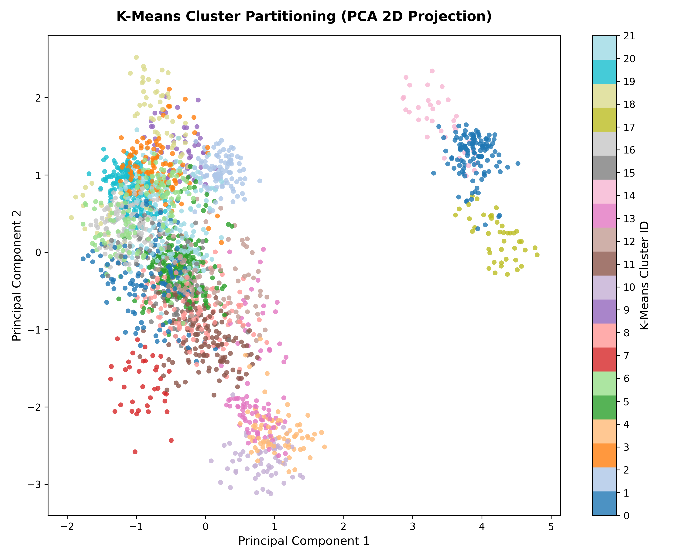
  _Deskripsi:_ Distribusi spasial hasil klasterisasi K-Means menunjukkan pembagian wilayah bulat sferis yang memotong paksa kontinuitas kepadatan elipsoid tanaman asli.

- **Gambar 6: PCA Scatter Plot GMM**
  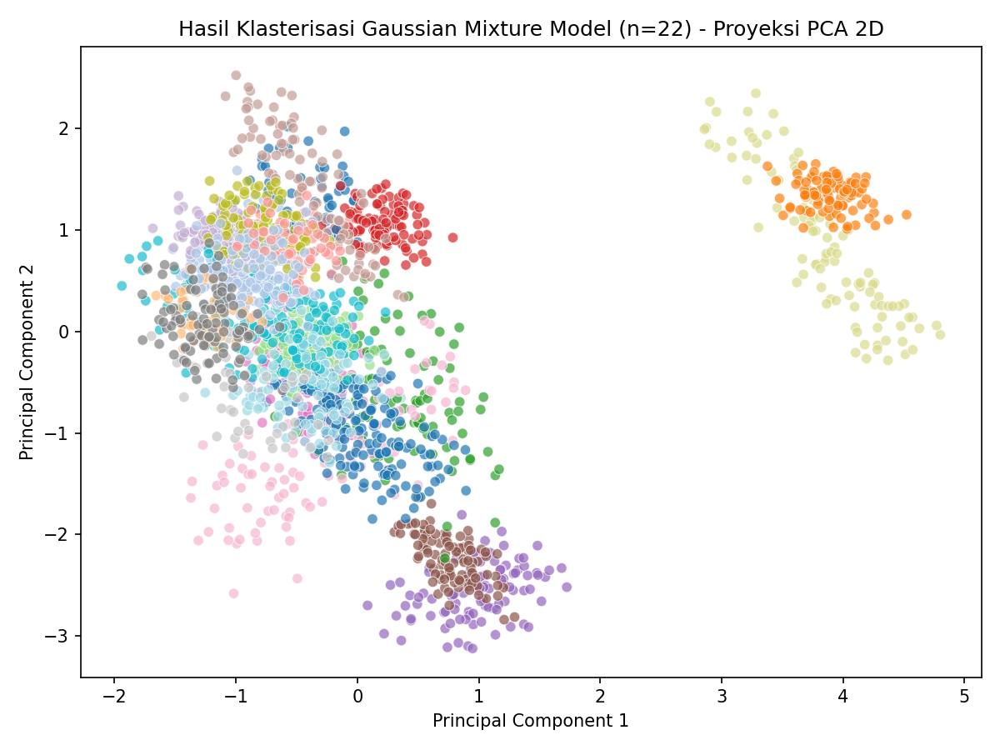
  _Deskripsi:_ Distribusi spasial hasil GMM memperlihatkan kemampuan adaptasi bentuk klaster elipsoid miring yang saling tumpang-tindih secara alami sesuai persebaran data riil.

- **Gambar 7: Perbandingan Distribusi Ukuran Klaster (Cluster Size Distribution)**
  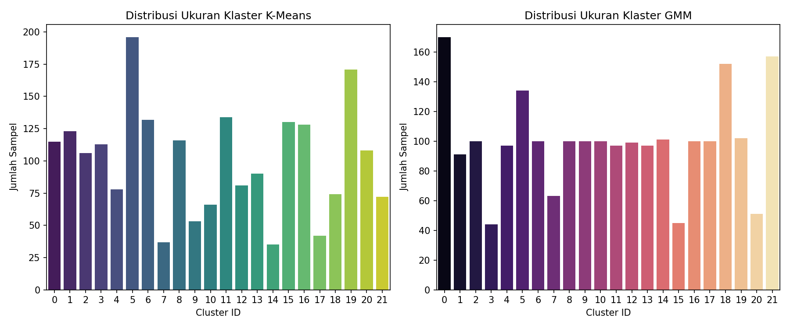
  _Deskripsi:_ K-Means memaksakan persebaran ukuran klaster yang seragam dan kaku, sedangkan GMM menghasilkan sebaran ukuran klaster yang dinamis dan adaptif terhadap kepadatan riil data (misal, Klaster 0 mencapai 170 sampel).

- **Gambar 8: Boxplot Perbandingan Kalium Sebelum & Setelah IQR Removal**
  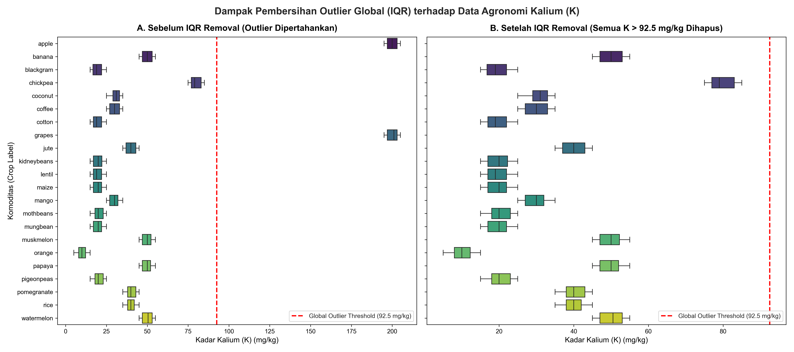
  _Deskripsi:_ Perbandingan sebaran hara Kalium (K) sebelum (Kiri) dan setelah (Kanan) penghapusan pencilan global berbasis IQR ($K > 92,5$ mg/kg). Terlihat bahwa setelah pembersihan pencilan global, seluruh data untuk komoditas Apel dan Anggur terhapus total dari dataset karena kebutuhan alami kadar hara kaliumnya yang tinggi.

- **Gambar 9: Heatmap Komposisi Klaster K-Means**
  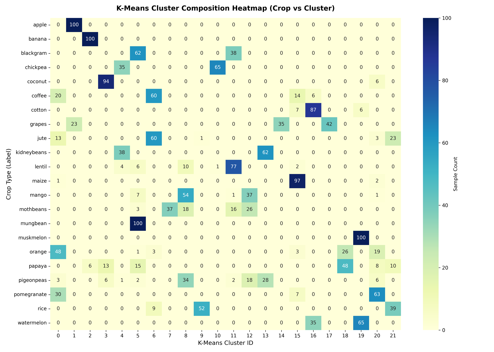
  _Deskripsi:_ Heatmap ini menggambarkan persebaran komoditas tanaman di seluruh klaster K-Means. Terlihat beberapa tanaman terfragmentasi ke banyak klaster (misalnya _pigeonpeas_ tersebar di 9 klaster berbeda).

- **Gambar 10: Heatmap Komposisi Klaster GMM**
  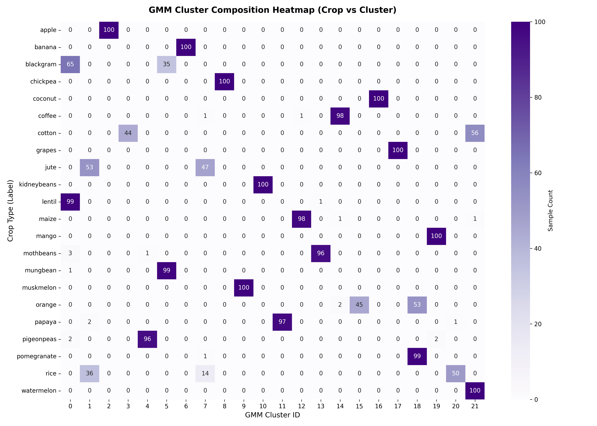
  _Deskripsi:_ Heatmap GMM menunjukkan konsentrasi tanaman yang jauh lebih kompak pada klaster tertentu (maksimal hanya menyebar di 3 klaster), merefleksikan keselarasan dengan kelompok asosiasi tanaman asli.

- **Gambar 11: Bar Chart Perbandingan Performa Klasifikasi Multilabel (K-Means vs GMM)**
  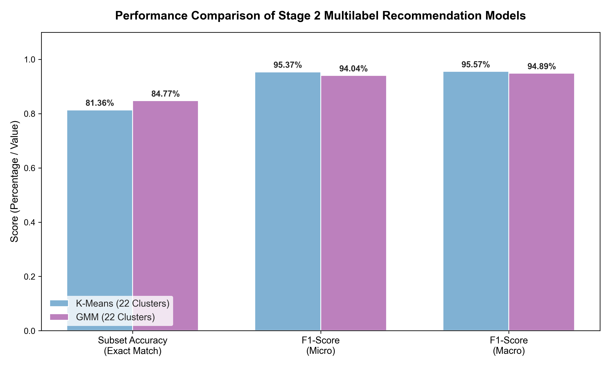
  _Deskripsi:_ Grafik batang perbandingan performa klasifikasi multilabel Tahap 2, menunjukkan keunggulan GMM pada Subset Accuracy (84,77%) dan keunggulan tipis K-Means pada F1-Score Micro (95,37%) dan Macro (95,57%).

- **Gambar 12: Multilabel Confusion Matrix per Komoditas (GMM Target Pipeline)**
  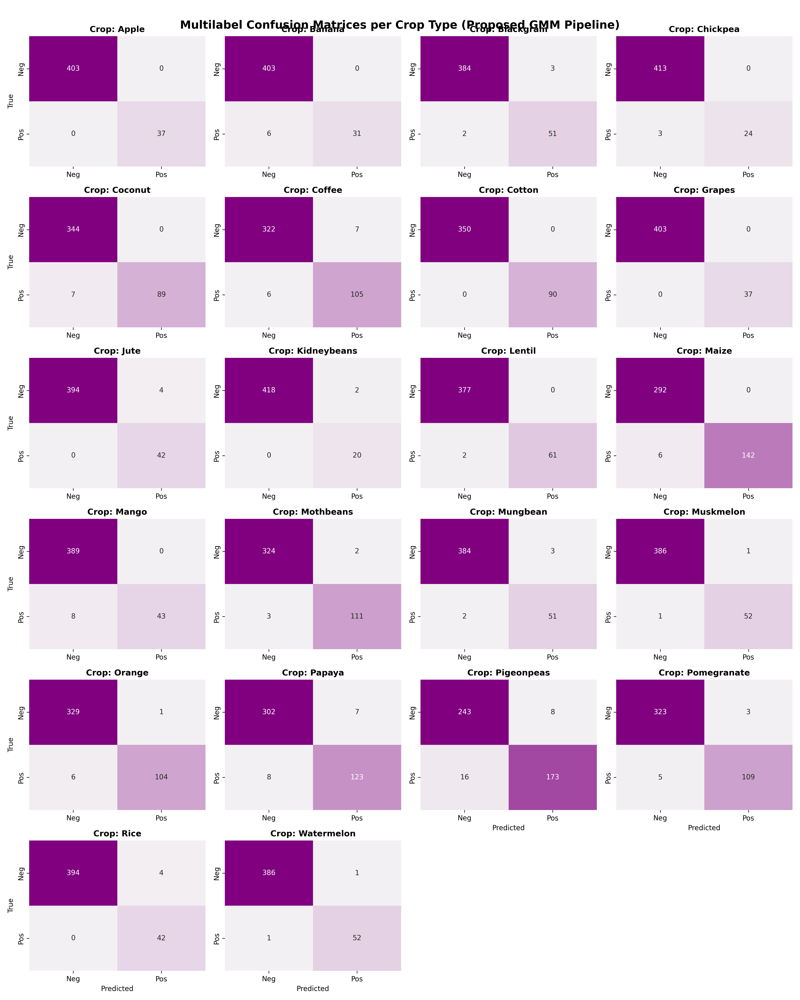
  _Deskripsi:_ Grid matriks konfusi multilabel biner untuk 22 komoditas tanaman pada data uji, menunjukkan jumlah True Positive (TP), False Positive (FP), False Negative (FN), dan True Negative (TN) untuk setiap komoditas secara individual.

#### 3. Analisis Galat (Error Analysis)

Evaluasi mendalam terhadap hasil prediksi model klasifikasi terawasi multilabel pada Tahap 2 menyingkap pola galat berikut:

- **Ambiguitas pada Target GMM:**
    - Komoditas **`coffee`** mencatatkan nilai F1-Score terendah (**0,8333**). Secara agronomi, kebutuhan tanah kopi (terutama Nitrogen menengah dan curah hujan tinggi) sangat ambigu karena tumpang-tindih dengan tanaman sawah tropika basah seperti `jute` dan `rice` (pada Klaster 7) serta tanaman kelembaban moderat seperti `maize` (pada Klaster 12 dan 14).
    - Komoditas legum seperti **`mothbeans`** (F1-Score **0,8841**) dan **`pigeonpeas`** (F1-Score **0,8921**) sering mengalami salah prediksi silang (misklasifikasi) karena keduanya terkelompok bersama dalam satu rumpun klaster legum homogen (Klaster 0, 4, dan 13).
- **Ambiguitas pada Target K-Means:**
    - Klasifikasi berbasis target K-Means memiliki galat prediksi tertinggi pada tanaman **`maize`** dan **`pomegranate`** dengan F1-Score terendah sebesar **0,8740**. Pemecahan paksa sebaran kedua tanaman ini oleh K-Means ke dalam klaster minor acak memicu kekacauan label target (_target noise_) yang menghalangi model Random Forest mencapai konvergensi optimal untuk kelas tersebut.

---

## 4. BAB IV: KESIMPULAN (CONCLUSION)

### 4.1 Kesimpulan

1. Rancang bangun sistem rekomendasi komoditas pertanian multilabel diimplementasikan melalui pendekatan pembelajaran dua tahap: klasterisasi tidak terawasi (_unsupervised_) diikuti klasifikasi terawasi multilabel (_supervised multilabel_).
2. Perbandingan antara klasterisasi kaku atau _hard clustering_ (K-Means) dan klasterisasi lunak atau _soft clustering_ (GMM) menunjukkan **GMM menghasilkan keselarasan yang lebih tinggi dengan pengelompokan tanaman asli** dengan nilai Adjusted Rand Index (ARI) mencapai 0,816 dibanding K-Means yang sebesar 0,519. Di sisi lain, K-Means menghasilkan klaster dengan batasan spasial geometris yang lebih kompak dengan Silhouette Score 0,307 (GMM 0,230) dan Davies-Bouldin Index 1,081 (GMM 1,716).
3. Evaluasi pada tahap kedua menunjukkan keberhasilan pemanfaatan hasil klasterisasi sebagai target multilabel, di mana target berbasis GMM menghasilkan Subset Accuracy (Exact Match) tertinggi sebesar **84,77%** (berbanding K-Means **81,36%**), sedangkan target berbasis K-Means unggul pada F1-Score Micro sebesar **0,9537** (berbanding GMM **0,9404**).
4. Kebijakan pemeliharaan pencilan (_outlier preservation_) menunjukkan peran krusial untuk mencegah hilangnya taksonomi tanaman bernilai tinggi (seperti apel dan anggur) yang membutuhkan konsentrasi hara tanah yang ekstrem.

### 4.2 Saran dan Batasan Riset

1. **Batasan Geografis dan Variabilitas Tanah:** Penelitian ini dibatasi oleh penggunaan dataset publik sekunder yang bersifat statis dari satu wilayah referensi. Model klasifikasi dan klasterisasi yang dibangun perlu divalidasi lebih lanjut jika diterapkan pada wilayah geografis lain dengan karakteristik jenis tanah (seperti tanah gambut, podsolik, atau aluvial) yang memiliki parameter dasar berbeda.
2. **Ketiadaan Sensor Real-Time:** Pengukuran parameter agronomi dalam penelitian ini masih diasumsikan berbasis data stasioner hasil pengujian laboratorium tanah. Implementasi praktis di masa depan membutuhkan integrasi sensor fisik IoT tanah untuk menangkap fluktuasi iklim mikro secara real-time.
3. **Optimasi Model Tahap Kedua:** Mengeksplorasi algoritma multilabel yang lebih kompleks (seperti Classifier Chains atau Multi-output Neural Networks) untuk memaksimalkan nilai Subset Accuracy dan F1-Score.
4. **Integrasi Data Temporal:** Memasukkan parameter temporal (musim tanam) untuk menyesuaikan luaran sistem rekomendasi secara dinamis.

---

## 5. DAFTAR PUSTAKA

[1] T. Anitha and D. Sathyabama, "Analysis of soil data using data mining classification techniques," _International Journal of Computer Science and Engineering_, vol. 6, no. 5, pp. 89–94, 2018.

[2] V. Pudumalar, E. Ramanujam, R. H. Rajashree, C. Kavya, T. Kiruthika, and J. Nisha, "Crop recommendation system for precision agriculture," _Proc. 8th IEEE Int. Conf. on Advanced Computing_, pp. 32–36, 2017, doi: 10.1109/IACC.2017.0017.

[3] A. Mucherino, P. J. Papajorgji, and P. M. Pardalos, _Data Mining in Agriculture_. New York: Springer Science & Business Media, 2009.

[4] S. S. Dahikar and S. V. Rode, "Agricultural crop selection using machine learning approach," _Int. Journal of Innovative Science, Engineering & Technology_, vol. 1, no. 2, pp. 11–16, 2014.

[5] M. Kuhn and K. Johnson, _Applied Predictive Modeling_. New York: Springer, 2013, doi: 10.1007/978-1-4614-6849-3.

[6] A. Savla, P. Dhawan, H. Katta, D. Jaswal, and V. Ramesh, "Analysis of supervised and unsupervised machine learning approaches in crop recommendation," _Lecture Notes in Networks and Systems_, vol. 471, pp. 197–213, 2022, doi: 10.1007/978-981-19-2538-2_17.

[7] A. Purba, A. Mulia Lubis, and M. Syahrizal, "Penerapan metode K-Means clustering untuk pengelompokan wilayah berdasarkan karakter tanah," _Jurnal Ilmiah Infotek_, vol. 7, no. 1, pp. 1–9, 2022.

[8] L. Karthikeyan, I. Khan, A. Bhama, and B. K. Panigrahi, "A review of remote sensing applications in agriculture for food security: Crop growth and production, irrigation, and crop losses," _Journal of Hydrology_, vol. 586, p. 124905, 2020, doi: 10.1016/j.jhydrol.2020.124905.

[9] L. Breiman, "Random forests," _Machine Learning_, vol. 45, no. 1, pp. 5–32, 2001, doi: 10.1023/A:1010933404324.

[10] A. P. Dempster, N. M. Laird, and D. B. Rubin, "Maximum likelihood from incomplete data via the EM algorithm," _Journal of the Royal Statistical Society: Series B (Methodological)_, vol. 39, no. 1, pp. 1–22, 1977.

[11] G. J. McLachlan and D. Peel, _Finite Mixture Models_. New York: Wiley-Interscience, 2000, doi: 10.1002/0471721182.

[12] A. K. Jain, "Data clustering: 50 years beyond K-Means," _Pattern Recognition Letters_, vol. 31, no. 8, pp. 651–666, 2010, doi: 10.1016/j.patrec.2009.09.011.

[13] M.-L. Zhang and Z.-H. Zhou, "A review on multi-label learning algorithms," _IEEE Trans. on Knowledge and Data Engineering_, vol. 26, no. 8, pp. 1819–1837, 2014, doi: 10.1109/TKDE.2013.39.

[14] G. Tsoumakas and I. Katakis, "Multi-label classification: An overview," _International Journal of Data Warehousing and Mining_, vol. 3, no. 3, pp. 1–13, 2007, doi: 10.4018/jdwm.2007070101.

[15] J. Read, B. Pfahringer, G. Holmes, and E. Frank, "Classifier chains for multi-label classification," _Machine Learning_, vol. 85, no. 3, pp. 333–359, 2011, doi: 10.1007/s10994-011-5256-5.

[16] P. Rousseeuw, "Silhouettes: A graphical aid to the interpretation and validation of cluster analysis," _Journal of Computational and Applied Mathematics_, vol. 20, pp. 53–65, 1987, doi: 10.1016/0377-0427(87)90125-7.

[17] D. L. Davies and D. W. Bouldin, "A cluster separation measure," _IEEE Trans. on Pattern Analysis and Machine Intelligence_, vol. PAMI-1, no. 2, pp. 224–227, 1979, doi: 10.1109/TPAMI.1979.4766909.

[18] L. Hubert and P. Arabie, "Comparing partitions," _Journal of Classification_, vol. 2, no. 1, pp. 193–218, 1985, doi: 10.1007/BF01908075.

[19] I. T. Jolliffe and J. Cadima, "Principal component analysis: A review and recent developments," _Philosophical Transactions of the Royal Society A_, vol. 374, no. 2065, p. 20150202, 2016, doi: 10.1098/rsta.2015.0202.

[20] F. Pedregosa et al., "Scikit-learn: Machine learning in Python," _Journal of Machine Learning Research_, vol. 12, pp. 2825–2830, 2011.
