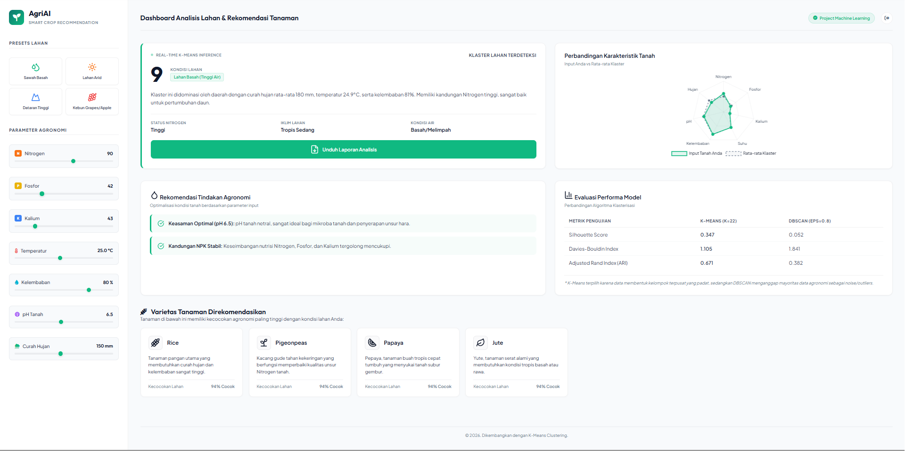
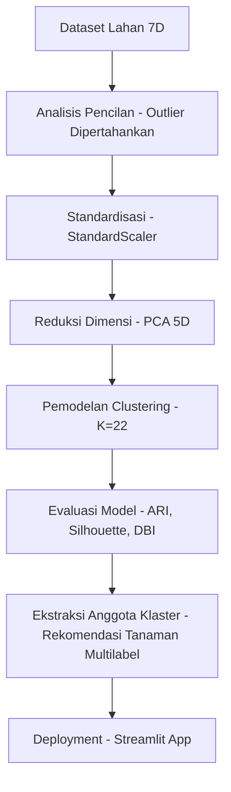

# Klasterisasi Karakteristik Lahan Agronomi untuk Sistem Rekomendasi Tanaman Multilabel

Proyek ini bertujuan untuk mengelompokkan lahan pertanian berdasarkan karakteristik agronomi dan mikroklimat menggunakan berbagai algoritma _Unsupervised Learning_ (**Gaussian Mixture Model (GMM)**, **Fuzzy C-Means (FCM)**, **K-Means**, **K-Medoids**, **Hierarchical Clustering**, dan **DBSCAN**). Dengan memetakan profil tanah ke dalam klaster agronomi tertentu, sistem ini mampu menghasilkan **rekomendasi tanaman multilabel (_multilabel crop recommendation_)** yang fleksibel guna mendukung pertanian presisi, rotasi tanaman, dan tumpang sari.

---



## 1. Formulasi Permasalahan & Ringkasan Akademik

### 1.1 Judul Penelitian

**Klasterisasi Karakteristik Lahan Agronomi Menggunakan Algoritma Unsupervised Learning untuk Sistem Rekomendasi Tanaman Multilabel**

### 1.2 Latar Belakang (Context)

Dalam era pertanian modern (_precision agriculture_), produktivitas hasil pertanian sangat bergantung pada ketepatan penanaman komoditas yang sesuai dengan kondisi biofisik lahan. Parameter agronomi penentu keberhasilan kultivasi meliputi kandungan unsur hara utama tanah (Nitrogen [N], Fosfor [P], Kalium [K]), tingkat keasaman tanah (pH), serta kondisi iklim mikro sekitar (suhu rata-rata, kelembaban relatif udara, dan intensitas curah hujan tahunan).

Sebagian besar penelitian sebelumnya memperlakukan pencarian kesesuaian tanaman ini sebagai masalah klasifikasi terawasi multi-kelas (_supervised multi-class classification_), di mana model memetakan parameter tanah ke satu jenis tanaman ($X \to Y$). Namun, pendekatan ini memiliki kelemahan mendasar:

1. **Multi-Kompatibilitas Lahan**: Secara alami, sebidang tanah dengan parameter agronomi tertentu tidak hanya cocok untuk satu jenis komoditas. Lahan tersebut dapat mendukung pertumbuhan beberapa jenis tanaman yang memiliki kebutuhan toleransi ekologis serupa.
2. **Kebutuhan Diversifikasi Tani**: Petani memerlukan alternatif tanaman guna memfasilitasi rotasi tanaman (_crop rotation_) demi menjaga kesehatan tanah, tumpang sari (_intercropping_), atau sebagai mitigasi risiko fluktuasi harga pasar dan gagal panen.

Dengan demikian, rekomendasi komoditas pertanian secara teoritis dan praktis merupakan sebuah kasus **rekomendasi multilabel (_multilabel recommendation_)** ($X \to \mathbf{y}$ di mana $\mathbf{y} \subset \text{Crops}$).

### 1.3 Rumusan Permasalahan (Core Problems)

1. **Keterbatasan Paradigma Klasifikasi Tunggal**: Pendekatan supervised konvensional membatasi keluaran sistem hanya pada satu label komoditas (_single-label_). Hal ini mengabaikan alternatif tanaman lain yang sebenarnya memiliki probabilitas tumbuh yang sama tingginya.
2. **Ketiadaan Dataset Multilabel Aktual**: Dataset pertanian yang tersedia secara publik umumnya hanya mencatat satu jenis komoditas yang ditanam secara historis pada setiap sampel parameter tanah (single-label per baris). Pembuatan dataset multilabel melalui uji laboratorium secara langsung sangat mahal dan memakan waktu lama.
3. **Rigiditas Batas Spasial Tanah (Boundary Uncertainty)**: Karakteristik tanah bersifat kontinu dan memiliki zona transisi. Penggunaan klasterisasi keras (_hard clustering_) seperti K-Means atau K-Medoids membagi ruang secara tegas, sehingga tidak mampu menangani ketidakpastian (_uncertainty_) pada perbatasan klaster. Hal ini memicu perlunya penggunaan klasterisasi lunak (_fuzzy/probabilistic clustering_) seperti _Gaussian Mixture Model (GMM)_ dan _Fuzzy C-Means (FCM)_ untuk memberikan rekomendasi multilabel berperingkat berdasarkan derajat keanggotaan.

### 1.4 Jenis Learning Task

- **Metode**: Unsupervised Learning (Clustering) didukung Reduksi Dimensi (PCA).
- **Pendekatan Rekomendasi**: Multilabel Recommendation berbasis Asosiasi Klaster & Keanggotaan Fuzzy/Probabilistik.
- **Algoritma yang Dievaluasi**:
    1. **Gaussian Mixture Model (GMM)** (Pendekatan Probabilistik)
    2. **Fuzzy C-Means (FCM)** (Pendekatan Logika Fuzzy)
    3. **K-Means Clustering** (Pendekatan Centroid)
    4. **K-Medoids / Partitioning Around Medoids (PAM)** (Robust Centroid)
    5. **Hierarchical (Agglomerative) Clustering** (Pendekatan Konektivitas)
    6. **DBSCAN** (Pendekatan Kerapatan Spasial - Density-Based)

### 1.5 Fitur Input (Variabel Agronomi)

| Fitur           | Satuan | Deskripsi                            |
| :-------------- | :----: | :----------------------------------- |
| **N**           | mg/kg  | Rasio kandungan Nitrogen dalam tanah |
| **P**           | mg/kg  | Rasio kandungan Fosfor dalam tanah   |
| **K**           | mg/kg  | Rasio kandungan Kalium dalam tanah   |
| **Temperature** |   °C   | Suhu lingkungan rata-rata            |
| **Humidity**    |   %    | Kelembaban relatif udara             |
| **pH**          |   -    | Skala keasaman tanah (0 - 14)        |
| **Rainfall**    |   mm   | Intensitas curah hujan tahunan       |

---

## 2. Dataset dan Representasi Data

### 2.1 Informasi Dataset

- **Sumber**: [Crop Recommendation Dataset (Kaggle)](https://www.kaggle.com/datasets/atharvaingle/crop-recommendation-dataset)
- **Format**: CSV (.csv)
- **Ukuran**: 2.200 baris × 8 kolom (7 fitur agronomi dan 1 target label kelas tanaman).
- **Target Label (Ground Truth)**: Terdiri dari 22 varietas tanaman unik (digunakan murni untuk evaluasi eksternal model clustering melalui metrik _Adjusted Rand Index_).

### 2.2 Deskripsi Fitur

Setiap baris data mencerminkan pengukuran tanah dan cuaca pada satu plot lahan, dengan target kelas tanaman yang berhasil dibudidayakan di lahan tersebut.

### 2.3 Tantangan Preprocessing & Kebijakan Outlier

- **Pemeliharaan Outlier (Outlier Preservation)**: Berdasarkan deteksi Boxplot, beberapa fitur (seperti Kalium/K, Fosfor/P, dan Curah Hujan/Rainfall) menunjukkan pencilan statistik yang tinggi. Proyek ini secara sadar **tidak menghapus outlier**. Penghapusan outlier secara global akan menghilangkan data tanaman spesifik yang secara biologis memang membutuhkan kadar ekstrim (contoh: Apel dan Anggur membutuhkan Kalium >200 mg/kg, sedangkan Padi membutuhkan curah hujan >180 mm).
- **Standardisasi Skala**: Rentang nilai antar fitur sangat timpang (misal: Nitrogen berkisar 0-140 mg/kg, sedangkan pH tanah berkisar 3.5-9.9). Oleh karena itu, standardisasi menggunakan `StandardScaler` mutlak diperlukan agar fitur berskala besar tidak mendominasi perhitungan jarak.
- **Reduksi Dimensi (PCA)**: Penerapan `PCA(n_components=5)` digunakan untuk mereduksi dimensi dari 7D ke 5D. Pendekatan ini mempertahankan **~89% variansi kumulatif data asli** sekaligus menyaring noise dan meningkatkan performa metrik evaluasi klaster.

---

## 3. Pipeline Machine Learning



1. **Preprocessing**: Validasi null, pemeriksaan duplikat, standardisasi fitur.
2. **Feature Engineering**: Proyeksi PCA 5-komponen untuk pelatihan model dan PCA 2-komponen untuk visualisasi scatterplot.
3. **Model Training**: Menjalankan 6 algoritma dengan jumlah klaster $K=22$ (sesuai dengan jumlah varietas tanaman asli untuk keperluan evaluasi ARI).
4. **Evaluation**:
    - **Silhouette Score**: Mengukur kerapatan klaster internal.
    - **Davies-Bouldin Index (DBI)**: Mengukur keterpisahan klaster.
    - **Adjusted Rand Index (ARI)**: Mengukur keselarasan hasil klasterisasi tanpa label dengan label aktual tanaman asli.
5. **Inference / Rekomendasi**: Lahan baru dipetakan ke dalam klaster, dan seluruh tanaman unik yang secara historis tumbuh subur di klaster tersebut disajikan sebagai **rekomendasi multilabel**.

---

## 4. Hasil Eksperimen & Perbandingan Model

### 4.1 Perbandingan Performa Model (pada Ruang PCA 5D)

Berikut adalah hasil komparasi performa model klasterisasi pada dataset pertanian (2.200 sampel):

| Algoritma                        | Silhouette Score | Davies-Bouldin Index (DBI) | Adjusted Rand Index (ARI) | Karakteristik Output                                                                               |
| :------------------------------- | :--------------: | :------------------------: | :-----------------------: | :------------------------------------------------------------------------------------------------- |
| **Gaussian Mixture Model (GMM)** |      0.230       |           1.716            |         **0.816**         | **Probabilistik (Soft)** - Rekomendasi multilabel berperingkat berdasarkan probabilitas posterior. |
| **Hierarchical (Agglomerative)** |      0.288       |           1.098            |           0.609           | Konektivitas (Hard)                                                                                |
| **K-Means Clustering**           |    **0.307**     |         **1.081**          |           0.519           | Centroid-Based (Hard) - Pembagian area tegas                                                       |
| **Fuzzy C-Means (FCM)**          |      0.243       |           1.379            |           0.511           | **Fuzzy (Soft)** - Derajat keanggotaan multilabel ($u_{ij} \in [0,1]$)                             |
| **K-Medoids (PAM)**              |      0.285       |           1.221            |           0.448           | Centroid-Based Robust (Hard)                                                                       |
| **DBSCAN**                       |      0.063       |           1.818            |           0.288           | Density-Based (Banyak noise: 636 data dianggap noise)                                              |

### 4.2 Pembahasan & Analisis Masalah Multilabel

1. **Keunggulan GMM**: GMM memperoleh nilai **ARI tertinggi (~0.816)** secara signifikan. Hal ini membuktikan bahwa persebaran data agronomi bersifat tumpang tindih (_overlapping density_) dan cocok dimodelkan dengan distribusi probabilitas Gaussian multivariat. Dalam konteks **rekomendasi multilabel**, GMM sangat unggul karena mampu menghasilkan probabilitas keanggotaan lahan terhadap beberapa klaster sekaligus, yang secara langsung dapat diterjemahkan menjadi tingkat keyakinan (_confidence level_) untuk rekomendasi tiap alternatif tanaman.
2. **Keterbatasan DBSCAN**: DBSCAN memiliki performa terendah (ARI = 0.288) dan mengkategorikan 28.91% data sebagai noise. Hal ini disebabkan karena kerapatan data agronomi antar varietas tanaman sangat bervariasi dan saling bertumpukan, sehingga algoritma berbasis kerapatan kaku gagal membedakan batas klaster dengan baik.
3. **K-Means vs FCM**: K-Means menghasilkan bentuk klaster sferis yang padat secara geometris (Silhouette = 0.307), namun FCM menawarkan keunggulan dalam hal fleksibilitas keanggotaan fuzzy yang sangat mendukung rekomendasi tanaman berperingkat pada wilayah perbatasan hara tanah.

---

## 5. Rencana Penyebaran (Deployment Plan)

Model diintegrasikan ke dalam aplikasi web interaktif berbasis **Streamlit**.

### 5.1 Format API Input (JSON)

```json
{
    "N": 90,
    "P": 42,
    "K": 43,
    "temperature": 25.0,
    "humidity": 80.0,
    "ph": 6.5,
    "rainfall": 150.0
}
```

### 5.2 Format API Output (JSON Rekomendasi Multilabel)

```json
{
    "predicted_cluster": 3,
    "clustering_model": "GMM",
    "confidence_score": 0.94,
    "recommended_crops": ["rice", "banana", "papaya"]
}
```

---

## 6. Kesimpulan dan Saran

### Kesimpulan

1. **Model Terbaik**: Gaussian Mixture Model (GMM) adalah model terbaik dengan tingkat kesesuaian taksonomi tanaman asli tertinggi (ARI = 0.816).
2. **Penyelesaian Kasus Multilabel**: Pendekatan klasterisasi terbukti berhasil memecahkan masalah rekomendasi tanaman multilabel secara alami dari dataset single-label tanpa memerlukan anotasi multilabel manual yang mahal.
3. **Pentingnya Outlier**: Karakteristik agronomi tertentu secara alami memiliki nilai ekstrem (seperti apel/anggur pada Kalium, padi pada curah hujan). Mempertahankan outlier merupakan langkah krusial untuk menjaga kelengkapan varietas rekomendasi.

### Saran Pengembangan Lanjutan

1. **Ensemble Soft Clustering**: Menggabungkan probabilitas posterior GMM dengan derajat keanggotaan Fuzzy C-Means untuk merancang sistem rekomendasi hibrida yang lebih tangguh terhadap fluktuasi musiman.
2. **Integrasi Kalender Tanam**: Menghubungkan keluaran rekomendasi tanaman multilabel dengan data ramalan cuaca bulanan BMKG untuk memberikan rekomendasi waktu tanam yang presisi bagi petani.
