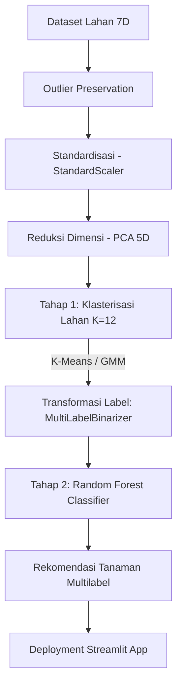

# Application of Soft and Hard Clustering on Agronomic Land Characteristics: An Unsupervised Approach for Multi-Commodity Crop Recommendation System

Proyek ini bertujuan untuk mengelompokkan lahan pertanian berdasarkan karakteristik agronomi dan mikroklimat menggunakan pendekatan **pembelajaran dua tahap (Two-Stage Machine Learning Pipeline)**:

1. **Tahap 1 (Unsupervised Learning)**: Pengelompokan lahan menggunakan **Gaussian Mixture Model (GMM)** dan **K-Means** untuk mengidentifikasi profil tanah.
2. **Tahap 2 (Supervised Multilabel Classification)**: Pelatihan model **Random Forest Classifier** menggunakan target hasil klasterisasi yang ditransformasikan secara multilabel (`MultiLabelBinarizer`) untuk menghasilkan rekomendasi komoditas secara simultan.

Sistem ini dirancang untuk mendukung pertanian presisi, rotasi tanaman, dan diversifikasi komoditas.

---

## 1. Struktur Direktori Proyek

Untuk menjaga kerapian dan kemudahan navigasi, workspace proyek telah ditata ke dalam struktur berikut:

```text
├── models/                      # File model terkompresi (.joblib)
│   ├── best_model.joblib
│   ├── gmm_model.joblib
│   ├── kmeans_model.joblib
│   ├── mlb_dbscan.joblib
│   ├── mlb_gmm.joblib
│   ├── mlb_kmeans.joblib
│   ├── pca_5.joblib
│   ├── scaler.joblib
│   ├── supervised_multilabel_dbscan.joblib
│   ├── supervised_multilabel_gmm.joblib
│   └── supervised_multilabel_kmeans.joblib
├── notebooks/                   # Jupyter Notebooks untuk eksperimen & evaluasi
│   ├── notebook 5.ipynb
│   ├── notebook kmeans-dbscan.ipynb
│   ├── notebook kmeans-gmm.ipynb
│   └── supervised_multilabel.ipynb
├── scripts/                     # Script Python untuk otomasi & visualisasi
│   ├── create_bar_chart.py      # Pembuatan Bar Chart komparasi metrik
│   ├── create_class_distribution.py # Pembuatan Bar Chart distribusi kelas ground truth
│   ├── create_confusion_matrix.py # Pembuatan Confusion Matrix Multilabel
│   ├── create_feature_correlation.py # Pembuatan Heatmap Korelasi Fitur Agronomi
│   ├── create_feature_distributions.py # Pembuatan Distribusi Frekuensi 7 Fitur Input
│   ├── create_heatmaps.py       # Pembuatan Heatmap Komposisi Klaster
│   ├── create_outlier_comparison.py # Pembuatan Perbandingan Boxplot Sebelum/Setelah IQR Removal
│   ├── create_pca_plots.py      # Pembuatan PCA Scatter Plots & Distribusi Klaster
│   └── gmm kmeans.py            # Pipeline pengujian metrics
├── crop_recommendation.csv      # Dataset agronomi
├── app.py                       # Aplikasi web interaktif Streamlit
├── draft_jurnal.md              # Draf artikel ilmiah utama
├── *.png                        # Visualisasi hasil plot (Figure 1-11)
└── readme.md                    # Dokumentasi utama proyek
```

---

## 2. Formulasi Permasalahan & Ringkasan Akademik

### 2.1 Judul Jurnal Utama

**"Penerapan Soft dan Hard Clustering pada Karakteristik Lahan Agronomi: Pendekatan Tanpa Label untuk Sistem Rekomendasi Tanaman Multi-Komoditas"**

### 2.2 Latar Belakang (Context)

Dalam pertanian presisi, produktivitas hasil panen sangat bergantung pada kesesuaian komoditas dengan kondisi hara tanah (N, P, K) dan mikroklimat (suhu, kelembaban, pH, curah hujan). Pendekatan klasifikasi konvensional satu label ($X \to y$) mengabaikan sifat alami lahan yang kompatibel dengan banyak tanaman (_multi-commodity compatibility_). Lahan membutuhkan sistem rekomendasi multilabel untuk rotasi tanaman, tumpang sari, dan manajemen risiko gagal panen.

### 2.3 Rumusan Masalah

1. **Rigiditas Batas Tanah**: Karakteristik tanah bersifat kontinu dan memiliki zona transisi. Penggunaan klasterisasi keras (_hard clustering_) memotong paksa kontinuitas hara data.
2. **Ketiadaan Dataset Multilabel Aktual**: Dataset publik umumnya bertipe label tunggal historis (_single-label_). Diperlukan pendekatan tanpa label (_unsupervised_) sebagai generator label multilabel target secara otomatis.

---

## 3. Dataset & Preprocessing

### 3.1 Profil Data

- **Sumber**: [Crop Recommendation Dataset (Kaggle)](https://www.kaggle.com/datasets/atharvaingle/crop-recommendation-dataset)
- **Format & Ukuran**: CSV, 2.200 baris × 8 kolom (7 fitur hara & iklim, 1 kolom label ground truth).

### 3.2 Pemeliharaan Outlier (Outlier Preservation)

Beberapa fitur menunjukkan pencilan statistik yang tinggi secara global (terutama Kalium/K dan Fosfor/P). Proyek ini secara sadar **mempertahankan outlier** karena data tersebut mewakili kondisi hara spesifik biologis tanaman bernilai tinggi (contoh: Apel dan Anggur secara alamiah membutuhkan Kalium ekstrem >200 mg/kg). Penghapusan pencilan global akan melenyapkan 100% sampel kedua tanaman tersebut dari taksonomi sistem rekomendasi.

---

## 4. Pipeline Pembelajaran Dua Tahap



---

## 5. Hasil Eksperimen & Perbandingan Model

### 5.1 Tahap 1: Evaluasi Performa Klasterisasi (Unsupervised)

| Algoritma                        | Silhouette Score | Davies-Bouldin Index (DBI) | Adjusted Rand Index (ARI) | Karakteristik Output                                                                                                                |
| :------------------------------- | :--------------: | :------------------------: | :-----------------------: | :---------------------------------------------------------------------------------------------------------------------------------- |
| **Gaussian Mixture Model (GMM)** |      0.286       |           1.246            |         **0.524**         | **Soft Clustering** - Menghasilkan orientasi klaster elipsoid dinamis yang tumpang-tindih secara alami sesuai persebaran data riil. |
| **K-Means Clustering**           |    **0.324**     |         **1.084**          |           0.413           | **Hard Clustering** - Menghasilkan pembagian spasial rigid bulat sferis (_Voronoi cells_).                                          |

### 5.2 Tahap 2: Evaluasi Akurasi Klasifikasi Multilabel (Supervised)

Tabel di bawah menyajikan performa agregat model Random Forest multilabel setelah transisi ke K=12 klaster (menggunakan validasi stabilitas multi-seed):

| Target Berbasis Model | Subset Accuracy (Exact Match Ratio) | F1-Score (Micro) | F1-Score (Macro) |
| :------------------------------ | :---------------------------------: | :--------------: | :--------------: |
| **Target GMM (12 Klaster)**     |         **89.70% ± 2.21%**          | **0.9662 ± 0.0079** | **0.9657 ± 0.0108** |
| **Target K-Means (12 Klaster)** |          84.02% ± 3.45%           | 0.9639 ± 0.0057  | 0.9566 ± 0.0074  |

---

## 6. Daftar Gambar Visualisasi Utama

Proyek ini menghasilkan visualisasi pembuktian yang disertakan dalam artikel ilmiah:

1. **`kmeans_pca_scatter.png` (Figure 1)**: Scatter plot 2D proyeksi PCA untuk klasterisasi K-Means.
2. **`gmm_pca_scatter.png` (Figure 2)**: Scatter plot 2D proyeksi PCA untuk klaster GMM.
3. **`cluster_distribution.png` (Figure 3)**: Perbandingan ukuran klaster, memperlihatkan K-Means memaksakan keseragaman ukuran sedangkan GMM adaptif terhadap kepadatan riil data.
4. **`outlier_comparison.png` (Figure 4)**: Boxplot perbandingan sebaran Kalium (K) sebelum dan setelah pembersihan outlier global berbasis IQR, memperlihatkan hilangnya komoditas Apel dan Anggur secara total.
5. **`kmeans_heatmap.png` (Figure 5)**: Heatmap komposisi klaster K-Means yang memperlihatkan fragmentasi spasial komoditas.
6. **`gmm_heatmap.png` (Figure 6)**: Heatmap komposisi klaster GMM yang memperlihatkan pengelompokan komoditas secara kompak sesuai relung ekologisnya.
7. **`model_comparison_bar.png` (Figure 7)**: Grafik batang perbandingan performa klasifikasi multilabel Tahap 2 (K-Means vs GMM) pada metrik Subset Accuracy dan F1-Score.
8. **`multilabel_confusion_matrix.png` (Figure 8)**: Grid matriks konfusi biner multilabel untuk masing-masing dari 22 komoditas tanaman pada dataset uji.
9. **`feature_distributions.png` (Figure 9)**: Grid plot histogram dan kurva KDE untuk melihat pola sebaran distribusi frekuensi dari 7 variabel agronomi input.
10. **`crop_class_distribution.png` (Figure 10)**: Bar chart horizontal sebaran sampel 22 jenis tanaman target aktual (ground truth).
11. **`feature_correlation.png` (Figure 11)**: Heatmap matriks korelasi Pearson antara 7 fitur input agronomi.

---

## 7. Deployment Aplikasi Streamlit

Aplikasi GUI web dapat dijalankan secara lokal dengan mengetikkan perintah berikut pada terminal:

```bash
streamlit run app.py
```

Aplikasi ini menyediakan antarmuka pengguna interaktif untuk memasukkan parameter agronomi tanah secara manual dan memilih algoritma klasterisasi guna memunculkan rekomendasi tanaman multilabel beserta metrik performanya secara real-time.
